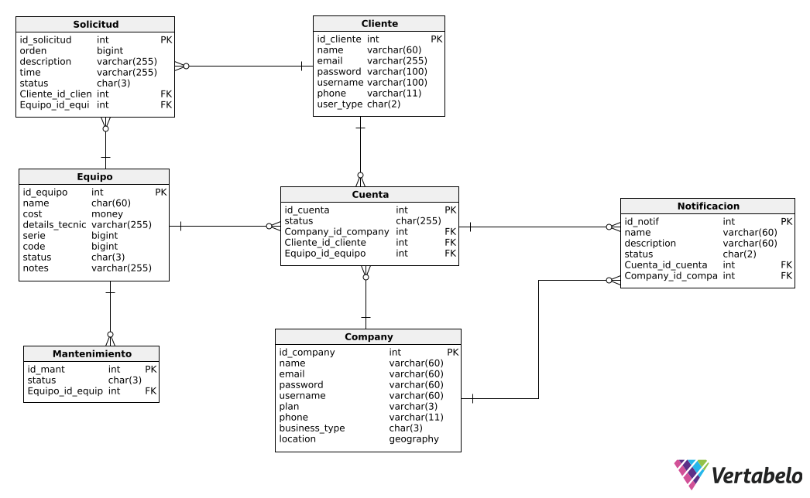
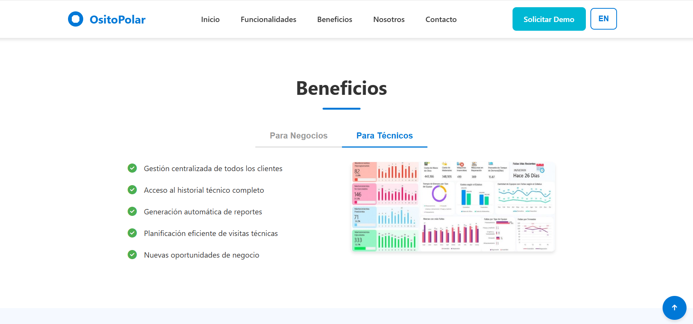
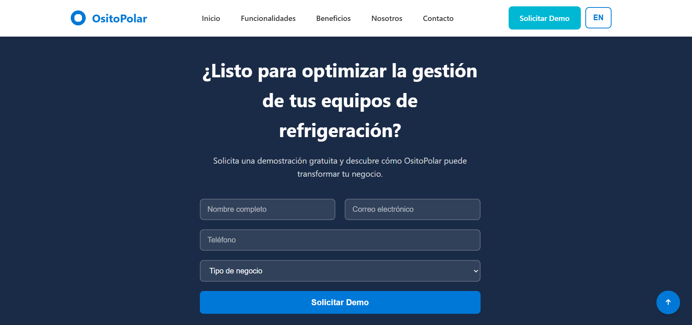

 <h1>Universidad Peruana de Ciencias Aplicadas</h1>
 
  <h2>Carrera: Ingeniería de Software</h2>
  <h2>Ciclo: 2025-1</h2>
 
  <h2>Curso: 1ASI0730 Aplicaciones Web</h2>
  <h2>Sección: 4378</h2>
  <h2>Profesor: Angel Augusto Velasquez Nuñez</h2>
 
 <h1>Informe TB1</h1>
  <h2>Startup: OsitoPolar</h2>
  <h2>Producto: Coolfreez</h2>
 
  <h2>Integrantes</h2>
<ul style="list-style: none;">
  <li><h3>U202222001 Aliaga Urbina Wilder Gonzalo</h3></li>
  <li><h3>U202220138 Ramírez Cabrera Kenyi Efraín</h3></li>
  <li><h3>U202223286 Rodriguez Parco Joseph Pablo</h3></li>
  <li><h3>U202123655 Rojas Reategui Victor Manuel</h3></li>
  <li><h3>U20221e617 Verona Flores Italo Sebastián</h3></li>
</ul>
 
   <h3>Abril 2025</h3>

## Registro de Versiones del Informe

| Versión | Fecha       | Autor        | Descripción de modificación         |
|---------|-------------|--------------|-------------------------------------|
| 0.1     |             |              |                                     |

## Project Report Collaboration Insights
URL de la organización del proyecto:

URL del repositorio del informe del proyecto:

## Contenido

- [Student Outcome](#student-outcome)

- [Capítulo I: Introducción](#c1)
    - [1.1. Startup Profile](#11-startup-profile)
        - [1.1.1. Descripción de la Startup](#111-descripción-de-la-startup)
        - [1.1.2. Perfiles de integrantes del equipo](#112-perfiles-de-integrantes-del-equipo)
    - [1.2. Solution Profile](#12-solution-profile)
        - [1.2.1 Antecedentes y problemática](#121-antecedentes-y-problemática)
        - [1.2.2 Lean UX Process](#122-lean-ux-process)
            - [1.2.2.1. Lean UX Problem Statements](#1221-lean-ux-problem-statements)
            - [1.2.2.2. Lean UX Assumptions](#1222-lean-ux-assumptions)
            - [1.2.2.3. Lean UX Hypothesis Statements](#1223-lean-ux-hypothesis-statements)
            - [1.2.2.4. Lean UX Canvas](#1224-lean-ux-canvas)
    - [1.3. Segmentos objetivo](#13-segmentos-objetivo)

- [Capítulo II: Requirements Elicitation & Analysis](#c2)
    - [2.1. Competidores](#21-competidores)
        - [2.1.1. Análisis competitivo](#211-análisis-competitivo)
        - [2.1.2. Estrategias y tácticas frente a competidores](#212-estrategias-y-tácticas-frente-a-competidores)
    - [2.2. Entrevistas](#22-entrevistas)
        - [2.2.1. Diseño de entrevistas](#221-diseño-de-entrevistas)
        - [2.2.2. Registro de entrevistas](#222-registro-de-entrevistas)
        - [2.2.3. Análisis de entrevistas](#223-análisis-de-entrevistas)
    - [2.3. Needfinding](#23-needfinding)
        - [2.3.1. User Personas](#231-user-personas)
        - [2.3.2. User Task Matrix](#232-user-task-matrix)
        - [2.3.3. User Journey Mapping](#233-user-journey-mapping)
        - [2.3.4. Empathy Mapping](#234-empathy-mapping)
        - [2.3.5. As-is Scenario Mapping](#235-as-is-scenario-mapping)
    - [2.4. Ubiquitous Language](#24-ubiquitous-language)

- [Capítulo III: Requirements Specification](#c3)
    - [3.1. To-Be Scenario Mapping](#31-to-be-scenario-mapping)
    - [3.2. User Stories](#32-user-stories)
    - [3.3. Impact Mapping](#33-impact-mapping)
    - [3.4. Product Backlog](#34-product-backlog)

- [Capítulo IV: Product Design](#c4)
    - [4.1. Style Guidelines](#41-style-guidelines)
        - [4.1.1. General Style Guidelines](#411-general-style-guidelines)
        - [4.1.2. Web Style Guidelines](#412-web-style-guidelines)
    - [4.2. Information Architecture](#42-information-architecture)
        - [4.2.1. Organization Systems](#421-organization-systems)
        - [4.2.2. Labeling Systems](#422-labeling-systems)
        - [4.2.3. SEO Tags and Meta Tags](#423-seo-tags-and-meta-tags)
        - [4.2.4. Searching Systems](#424-searching-systems)
        - [4.2.5. Navigation Systems](#425-navigation-systems)
    - [4.3. Landing Page UI Design](#43-landing-page-ui-design)
        - [4.3.1. Landing Page Wireframe](#431-landing-page-wireframe)
        - [4.3.2. Landing Page Mock-up](#432-landing-page-mock-up)
    - [4.4. Web Applications UX/UI Design](#44-web-applications-uxui-design)
        - [4.4.1. Web Applications Wireframes](#441-web-applications-wireframes)
        - [4.4.2. Web Applications Wireflow Diagrams](#442-web-applications-wireflow-diagrams)
        - [4.4.3. Web Applications Mock-ups](#443-web-applications-mock-ups)
        - [4.4.4. Web Applications User Flow Diagrams](#444-web-applications-user-flow-diagrams)
    - [4.5. Web Applications Prototyping](#45-web-applications-prototyping)
    - [4.6. Domain-Driven Software Architecture](#46-domain-driven-software-architecture)
        - [4.6.1. Software Architecture Context Diagram](#461-software-architecture-context-diagram)
        - [4.6.2. Software Architecture Container Diagrams](#462-software-architecture-container-diagrams)
        - [4.6.3. Software Architecture Components Diagrams](#463-software-architecture-components-diagrams)
    - [4.7. Software Object-Oriented Design](#47-software-object-oriented-design)
        - [4.7.1. Class Diagrams](#471-class-diagrams)
        - [4.7.2. Class Dictionary](#472-class-dictionary)
    - [4.8. Database Design](#48-database-design)
        - [4.8.1. Database Diagram](#481-database-diagram)

- [Capítulo V: Product Implementation, Validation & Deployment](#c5)
    - [5.1. Software Configuration Management](#51-software-configuration-management)
        - [5.1.1. Software Development Environment Configuration](#511-software-development-environment-configuration)
        - [5.1.2. Source Code Management](#512-source-code-management)
        - [5.1.3. Source Code Style Guide & Conventions](#513-source-code-style-guide--conventions)
        - [5.1.4. Software Deployment Configuration](#514-software-deployment-configuration)
    - [5.2. Landing Page, Services & Applications Implementation](#52-landing-page-services--applications-implementation)
        - [5.2.1. Sprint 1](#521-sprint-1)
            - [5.2.1.1. Sprint Planning 1](#5211-sprint-planning-1)
            - [5.2.1.2. Aspect Leaders and Collaborators](#5212-aspect-leaders-and-collaborators)
            - [5.2.1.3. Sprint Backlog 1](#5213-sprint-backlog-1)
            - [5.2.1.4. Development Evidence for Sprint Review](#5214-development-evidence-for-sprint-review)
            - [5.2.1.5. Execution Evidence for Sprint Review](#5215-execution-evidence-for-sprint-review)
            - [5.2.1.6. Services Documentation Evidence for Sprint Review](#5216-services-documentation-evidence-for-sprint-review)
            - [5.2.1.7. Software Deployment Evidence for Sprint Review](#5217-software-deployment-evidence-for-sprint-review)
            - [5.2.1.8. Team Collaboration Insights during Sprint](#5218-team-collaboration-insights-during-sprint)

- [Conclusiones](#conclusiones)
- [Bibliografía](#bibliografía)
- [Anexos](#anexos)

## Student Outcome
El curso contribuye al cumplimiento del Student Outcome ABET:

**ABET – EAC - Student Outcome 5**

**Criterio**: *La capacidad de funcionar efectivamente en un equipo cuyos miembros
juntos proporcionan liderazgo, crean un entorno de colaboración e inclusivo,
establecen objetivos, planifican tareas y cumplen objetivos.*

En el siguiente cuadro se describe las acciones realizadas y enunciados de
conclusiones por parte del grupo, que permiten sustentar el haber alcanzado el logro
del ABET – EAC - Student Outcome 5.

<table>
  <tr>
    <th>Criterio específico</th>
    <th>Acciones realizadas</th>
    <th>Conclusiones</th>
  </tr>
  <tr>
    <td>Trabaja en equipo para proporcionar liderazgo en forma conjunta.</td>
    <td>
 
 
 
 
    <td>
</td>
  </tr>
  <tr>
    <td>Crea un entorno colaborativo e inclusivo, establece metas, planifica tareas y cumple objetivos.</td>
    <td>
 
 
 
    </td>
    <td>
</td>
  </tr>
</table>

# Capitulo 1: Introducción

## 1.1 Startup Profile
### 1.1.1 Descripción de la Startup
### 1.1.2 Perfiles de integrantes del equipo
## 1.2 Solution Profile
### 1.2.1 Antecedentes y Problematica
### 1.2.2 Lean UX Process
#### 1.2.2.1 Lean UX Problem Statements
#### 1.2.2.2 Lean UX Assumption
#### 1.2.2.2 Lean UX Hypothesis Statements
#### 1.2.2.4 Lean UX Canvas
## 1.3 Segmentos objetivos

## Capítulo II: Requirements Elicitation & Analysis 

### 2.1. Competidores.
#### 2.1.1. Análisis competitivo.
#### 2.1.2. Estrategias y tácticas frente a competidores.
### 2.2. Entrevistas.
#### 2.2.1. Diseño de entrevistas.
#### 2.2.2. Registro de entrevistas.
#### 2.2.3. Análisis de entrevistas.
### 2.3. Needfinding.
#### 2.3.1. User Personas.
#### 2.3.2. User Task Matrix.
#### 2.3.3. User Journey Mapping.
#### 2.3.4. Empathy Mapping.
#### 2.3.5. As-is Scenario Mapping.
### 2.4. Ubiquitous Language.

## Capítulo III: Requirements Specification 

### 3.1. To-Be Scenario Mapping.
### 3.2. User Stories.
### 3.3. Impact Mapping.
### 3.4. Product Backlog.

## Capítulo IV: Product Design 

### 4.1. Style Guidelines
#### 4.1.1. General Style Guidelines

Se busca que el tono sea equilibrado, entre lo profesional y lo accesible, con un lenguaje claro, empático y respetuoso para atraer usuarios potenciales y mantener a nuestros usuarios.
Se eligió una paleta de colores fría pero amigable, y una tipografía moderna que combine profesionalismo y accesibilidad.

**Branding**

La identidad visual de OsitoPolar busca transmitir seguridad, innovación y cercanía.

**Logo:** Representa un oso polar con un ícono de refrigeración, combinando lo técnico con lo amigable. Disponible en versiones para fondos claros y oscuros, monocromático, horizontal y vertical.

**Typography**

Para mantener la formalidad y accesibilidad de la interfaz de usuario de OsitoPolar se establecerá las tipografías Helvetica y Open Sans por sus características funcionales, estéticas y por su alta compatibilidad en interfaces digitales, siendo Helvetica la primaria.

**Colors**

La paleta fue diseñada para representar ambientes fríos y tecnológicos, transmitiendo confianza y limpieza visual.

El color principal elegido es el celeste, pues es el que más se acopla a las características que describimos. Se optó por los colores negro, blanco y gris como neutros, los cuales serán utilizados para fondos o textos.
Se eligieron variantes de color verde, rojo, azul y amarillo para ciertos fondos y estados (alertas, servicio, calificaciones).

**Spacing**

Se establecerá un espaciado de 8 px y un margen mínimo de 16 px. Para el diseño modular, se implementarán grids flexibles que se adaptarán tanto a web como a dispositivos móviles, utilizando configuraciones de 12 y 4 columnas respectivamente.

#### 4.1.2. Web Style Guidelines

En esta sección definimos los estándares visuales y de interacción para la versión web de OsitoPolar, asegurando una experiencia de usuario coherente, profesional y accesible en todos los dispositivos.
Es necesario que las interfaces web sean responsivas porque nos trae muchas ventajas tanto para el usuario como para el equipo desarrollador, entre las cuales tenemos: usabilidad en cualquier dispositivo, mejor eficiencia de costos y tiempo en el desarrollo y satisfacción del usuario.

Adoptando un enfoque mobile-first, usamos un sistema de grid de 12 columnas para que la interfaz se adapte a cualquier dispositivo.

**Tipografía**
Tomando en cuenta la guía de estilos, se usará la tipografía Helvetica en la mayoría de los textos de la aplicación, pues esta proyecta profesionalismo y claridad. Para que la visualización de los textos sea óptima, el tamaño de la fuente debe ajustarse automáticamente y adaptarse al dispositivo que se esté usando.

**Colores**
De acuerdo al rubro al que está orientado OsitoPolar, los colores deben reflejar tecnología, frescura y confianza. La elección de colores es la siguiente:

- Celeste (#0884C4): Se usará para el header y algunos botones.
- Blanco (#FFFFFF): Se usará para fondos neutros.
- Negro (#000000): Se usará en algunos botones y bordes.
- Gris claro (#808080): Se usará para líneas, bordes, separadores y botones deshabilitados.
- Blanco azul mar (#F4FCFC): Se usará para algunos fondos.
- Verde medio primavera (#00CC66): Se usará para notificaciones y estados positivos.
- Rojo claro (#FF4B4B): Se usará para alertas, errores y fallas críticas.
- Amarillo mandarina (#FFCC00): Se usará para ciertos agregados (notificaciones, calificaciones).

Sin embargo, la variación de botones y fondos que tendrá la plataforma hace que no siempre se elija la misma tonalidad, por lo que optamos por una paleta de celeste.

De la misma forma se opta por una paleta de rojo claro para diferenciar ventanas, fondos o íconos que muestren algún tipo de error en el sistema, alertas o estados.

### 4.2. Information Architecture

#### 4.2.1. Organization Systems

En esta sección, hemos implementado diferentes sistemas de organización basados en los grupos de información relevantes. La disposición visual del contenido se ha realizado de las siguientes maneras:

- **Jerárquica (visual hierarchy)**: Para resaltar los elementos más importantes, facilitando que los usuarios accedan de manera intuitiva a la información clave.

- **Organización secuencial (step-by-step)**: Utilizada en procesos que requieren una guía detallada, como la compra de maquinas, asegurando un flujo lógico y fácil de seguir.

- **Organización matricial**: Aplicada en áreas donde es necesario comparar o analizar datos relacionados, proporcionando al usuario una visión clara y estructurada de las opciones disponibles.

#### 4.2.2. Labeling Systems

En nuestra empresa, aplicamos estos sistemas de organización visual de la siguiente manera:

Jerarquía Visual: Destacamos información clave como el estado de los equipos y alertas críticas para facilitar su rápida identificación.

Organización Secuencial: El proceso de agendar mantenimiento o visitas técnicas se organiza paso a paso para guiar al usuario.

Organización Matricial: Usamos tablas comparativas para mostrar claramente las diferencias entre planes de suscripción y servicios, facilitando la elección del usuario.

#### 4.2.3. SEO Tags and Meta Tags

**Landing Page**
-Title: OsitoPolar - Monitorea y Gestiona tus Equipos de Congelación en Tiempo Real
-Meta Description: OsitoPolar te permite monitorear y gestionar el estado de tus equipos de congelación, optimizando su rendimiento y evitando fallas. Mantén tu inventario seguro con alertas y mantenimiento predictivo.
-Meta Keywords: monitoreo de congeladoras, gestión de equipos de frío, mantenimiento preventivo, OsitoPolar, alerta de fallas, eficiencia energética
-Meta Author: OsitoPolar

**Aplicación Web**
-Title: OsitoPolar - Plataforma de Gestión de Equipos de Congelación
-Meta Description: OsitoPolar facilita el monitoreo, mantenimiento y eficiencia de tus equipos de congelación. Gestiona en tiempo real el estado y rendimiento de tus equipos con facilidad.
-Meta Keywords: gestión de equipos de frío, monitoreo en tiempo real, mantenimiento predictivo, OsitoPolar, alerta de fallas, reporte de eficiencia
-Meta Author: OsitoPolar

#### 4.2.4. Searching Systems

Estas decisiones están orientadas a facilitar la navegación eficiente, evitando que los usuarios se sientan abrumados por grandes volúmenes de datos y asegurando que encuentren rápidamente lo que necesitan.

**Opciones de Búsqueda**  
**Barra de Búsqueda**  
La barra de búsqueda permite a los usuarios ingresar términos específicos, como el nombre de un equipo, tipo de servicio o estado del equipo, para encontrar rápidamente información relevante. Los resultados se muestran instantáneamente a medida que se escriben los términos.

**Categorías**  
Los usuarios pueden seleccionar entre diferentes categorías de servicios y equipos, como "Congeladoras", "Refrigeradores", "Mantenimiento Preventivo", "Alertas de Fallas" y "Historial de Consumo", para limitar los resultados a un grupo específico.

**Etiquetas Populares**  
Las etiquetas populares, como "Mantenimiento Programado" o "Alertas Críticas", permiten a los usuarios buscar servicios o equipos relacionados con términos comunes, facilitando la localización de opciones populares o especializadas.

**Filtros Disponibles**  
**Filtros por Tipo de Equipo**
- Congeladoras
- Refrigeradores
- Equipos de Frío Industrial

**Filtros por Estado del Equipo**
- En Funcionamiento
- En Reparación
- Necesita Mantenimiento

**Filtro por Fecha de Última Revisión**  
Los usuarios pueden ajustar el filtro para ver los equipos que han sido revisados en un periodo específico, como "Últimos 7 días", "Últimos 30 días", etc.

**Filtro por Consumo Energético**  
Los usuarios pueden ajustar el rango de consumo energético para encontrar equipos dentro de un rango de eficiencia energética deseado.

**Apariencia de los Datos Después de la Búsqueda**  
**Listados de Resultados**  
Los resultados de búsqueda se muestran en una lista ordenada con información clave, como el nombre del equipo, estado actual, próximas fechas de mantenimiento y consumo energético. Además, se incluyen opciones para ver más detalles o agendar visitas de mantenimiento.

**Resumen y Descripción**  
Cada resultado incluye un resumen que resalta la información más relevante, como el historial de mantenimiento o las alertas generadas, permitiendo a los usuarios realizar una evaluación rápida.

**Opciones de Ordenación y Filtros Aplicados**  
Los resultados pueden ordenarse por criterios como relevancia, estado del equipo o consumo energético. Los filtros aplicados se muestran claramente para que los usuarios puedan ajustar su búsqueda según sea necesario.

**Revisiones y Comentarios**  
Los usuarios pueden ver un resumen de las revisiones y comentarios de los técnicos o clientes anteriores sobre el equipo o servicio, lo que les ayuda a evaluar la calidad del servicio y tomar decisiones informadas.

#### 4.2.5. Navigation Systems

La estructura de navegación y las opciones disponibles en **OsitoPolar** están diseñadas para ofrecer una experiencia de usuario fluida y eficiente. A continuación, se resumen las secciones y elementos clave:

1. **Páginas Principales**
    - **Inicio**: Página principal del sitio web.
    - **Funcionalidades**: Detalles sobre las herramientas y servicios que ofrece OsitoPolar.
    - **Beneficios**: Información sobre las ventajas para empresas y proveedores.
    - **Nosotros**: Información sobre la empresa y su misión.
    - **Contacto**: Información de contacto y formulario.

2. **Opciones de Usuario**
    - **Login**: Acceso a cuentas de usuario.
    - **Sign-up**: Registro de nuevos usuarios.
    - **Iniciar sesión / Registrarse**: Alternativa para acceso o creación de cuenta.

3. **Búsqueda y Navegación**
    - **Búsqueda**: Barra de búsqueda para encontrar equipos, servicios o reportes.
    - **Categorías**: Filtros por tipo de equipo (Congeladoras, Refrigeradores, etc.).
    - **Explorar**: Opciones para navegar por diferentes secciones de la plataforma.

4. **Branding y Identidad**
    - **OsitoPolar**: Logo y nombre de la marca, repetidos en varias secciones para mantener la identidad visual de la plataforma.

### 4.3. Landing Page UI Design
#### 4.3.1. Landing Page Wireframe

El wireframe de la página de inicio de OsitoPolar organiza los elementos clave para ofrecer una navegación intuitiva. Incluye un encabezado con el logo y un menú de navegación, seguido de una propuesta de valor clara con botones de acción destacados como "Solicitar Demo" y "¿Cómo Funciona?". La página cuenta con secciones para describir a los usuarios objetivo, las funcionalidades clave del sistema, y los beneficios que ofrece OsitoPolar. Al final, se encuentra un formulario de contacto para que los usuarios soliciten una demo, junto con enlaces legales en el pie de página.

#### 4.3.2. Landing Page Mockup

El Landing Page Mock-up de OsitoPolar muestra un diseño limpio y organizado, con una estructura intuitiva que guía a los usuarios a través de la plataforma. Incluye una propuesta de valor destacada en la parte superior, seguida de secciones clave como las funcionalidades del sistema, los beneficios para empresas y proveedores, y una explicación clara de cómo funciona el servicio. También cuenta con testimonios de clientes, detalles sobre la empresa y un formulario para solicitar una demo, todo con un enfoque en facilitar la conversión de visitantes a usuarios activos.

## 4.4. Web Applications UX/UI Design

#### 4.4.1. Web Applications Wireframes

Los wireframes de las aplicaciones web de OsitoPolar delinean la estructura y organización de las pantallas principales, especificando la ubicación de los elementos de la interfaz de usuario y la navegación. Estos esquemas visuales sirven como una guía precisa para el diseño final, asegurando una experiencia de usuario fluida e intuitiva. Los wireframes están enfocados en la funcionalidad y facilidad de uso, permitiendo que diseñadores y desarrolladores visualicen cómo los usuarios interactúan con la aplicación, optimizando la disposición de los elementos para crear una experiencia eficiente y atractiva.

#### 4.4.2. Web Applications Wireflow Diagrams
En esta sección se presentan los Wireflows para cada objetivo del usuario, teniendo en cuenta los User Personas relevantes. Cada diagrama ilustra el flujo de interacción del usuario y cómo las acciones realizadas afectan las pantallas dentro de la aplicación.

### **Registro y Perfil de Empresa**:
Este flujo de usuario corresponde al proceso de registro de una nueva empresa. En este flujo, el usuario ingresa la información empresarial, como nombre de la empresa y datos de contacto. Al completar el registro, la empresa pasa a estar registrada en la plataforma, con acceso a todas las funcionalidades de gestión de equipos.

### **Gestión de Usuario**:
Este flujo de usuario describe las acciones para que el usuario se registre, inicie sesión, vea su perfil y edite su información personal. El objetivo es mantener actualizados los datos del usuario y facilitar el acceso a sus funcionalidades.

### **Visualización de Equipos**:
En este flujo, el usuario ve un resumen de todos los equipos registrados en su cuenta. Puede ver el estado de los equipos y obtener detalles de cada uno, como su mantenimiento.

### **Gestión de Solicitudes**:
Este flujo permite a las empresas gestionar las solicitudes que realizan los clientes para obtener servicios o equipos adicionales. La empresa puede **aceptar** o **negar** solicitudes.

### **Visualización de Mantenimientos**:
Este flujo permite al usuario ver los mantenimientos pendientes para los equipos. Las empresas pueden agendar o realizar un mantenimiento directamente desde esta vista.

### **Notificaciones**:
Este flujo gestiona las notificaciones que se muestran al usuario, como alertas de mantenimiento, solicitudes aceptadas o rechazadas, y otros eventos importantes.

### **Cambio de Plan de Suscripción**:
Este flujo permite a los usuarios cambiar el plan de suscripción para ajustarse a sus necesidades de equipos o servicios. Los usuarios pueden seleccionar entre diferentes planes según la cantidad de equipos o características que necesiten.

### **Ordenes de trabajo**:
Este flujo permite a las empresas gestionar las órdenes de trabajo generadas por los clientes, de igual manera se puede visualizar si el trabajo ha sido realizado.

### **Mi Equipo y Monitoreo en tiempo real**:
Este flujo permite a los clientes visualizar el estado de su equipo en tiempo real, así como los mantenimientos realizados y las alertas generadas. Los usuarios pueden ver el historial de consumo energético y recibir notificaciones sobre el estado del equipo.

#### 4.4.3. Web Applications Mock-ups
En esta sección se presentan y detallan los mock-ups de las aplicaciones de OsitoPolar. Se resalta la aplicación de los principios de diseño, la arquitectura de la información, el diseño inclusivo y el Design System implementado en los productos digitales. Cada mock-up muestra cómo estos conceptos se integran en la interfaz de usuario. A continuación, se mostrarán las maquetas de la aplicación web, que representan visualmente cómo se verá y funcionará la plataforma OsitoPolar. Estas maquetas son fundamentales para comunicar el diseño a los desarrolladores y clientes, asegurando que la experiencia del usuario se alinee con la visión del proyecto.

Link de los mockups: https://www.figma.com/design/flGQQP3T3S1hLfh0I72Exj/Aplicaciones-Web?node-id=2313-3&t=UphT97uJSGQzmQl1-1

#### 4.4.4. Web Applications User Flow Diagrams
A continuación un diagrama que representa los user goals.

### 4.5. Web Applications Prototyping
A continuación se presenta el prototipo de la aplicación web de OsitoPolar, el cual permite a los usuarios interactuar con la interfaz y explorar las diversas secciones de la plataforma. Este prototipo incluye las funcionalidades clave y características de la aplicación, proporcionando una vista preliminar de la experiencia del usuario. Además, facilita la evaluación y prueba de la interfaz antes de su implementación final, asegurando que el diseño sea intuitivo y eficiente.
Link del prototipo: https://www.figma.com/proto/flGQQP3T3S1hLfh0I72Exj/Aplicaciones-Web?node-id=2380-1261&p=f&t=oDeAQCXay9dwRQG6-1&scaling=min-zoom&content-scaling=fixed&page-id=2313%3A3&starting-point-node-id=2380%3A1233&show-proto-sidebar=1

### 4.6 Domain Driven Software Architecture
En esta sección se presenta la arquitectura de software basada en el dominio para OsitoPolar. Se detallan los diferentes diagramas que ilustran la estructura y organización del sistema, así como los componentes clave que lo integran, mostrando cómo se interconectan para proporcionar una solución eficiente y escalable.

#### 4.6.1. Software Architecture Context Diagram
Este diagrama muestra cómo interactúan los usuarios (Clientes y Empresas Proveedoras) con OsitoPolar. Los usuarios usan la plataforma para gestionar y monitorear equipos de refrigeración. Además, OsitoPolar se conecta con los servicios de correo para enviar notificaciones y con el servicio de pago para procesar transacciones.

#### 4.6.2. Software Architecture Container Diagrams
Este diagrama ilustra los diferentes contenedores dentro de OsitoPolar y cómo interactúan entre sí. Los contenedores representan las diferentes capas y servicios que componen la plataforma, como la interfaz de usuario (webapp), la API y la base de datos.

#### 4.6.3. Software Architecture Components Diagrams

**Mi Equipo Bounded Context**

Este diagrama representa los componentes encargados de la gestión de equipos. Los usuarios pueden agregar equipos, monitorearlos en tiempo real y ver el estado de los mismos.

**Notificaciones Bounded Context**

Este diagrama describe los componentes que gestionan las notificaciones, esenciales para mantener a los usuarios informados sobre el estado de los equipos y otros eventos importantes.

**Ordenes de trabajo Bounded Context**

Este diagrama se centra en la gestión de las órdenes de trabajo. Aquí se muestran los componentes involucrados en el proceso de crear, gestionar y completar órdenes de trabajo.

### 4.7. Software Object-Oriented Design
En esta sección se presenta el diseño de software orientado a objetos para OsitoPolar. Se incluyen diagramas de clases y un diccionario de clases que detallan la estructura y los atributos de las principales entidades del sistema, ofreciendo una visión clara de cómo se organizan y gestionan los componentes clave dentro de la plataforma.

#### 4.7.1. Class Diagrams

El diagrama de clases proporciona una representación visual de las clases del sistema, sus atributos y las relaciones entre ellas.

#### 4.7.2. Class Dictionary

## Clase: Solicitud
| Nº | Nombre de atributo | Descripción                                              | Tipo de dato      |
|----|--------------------|----------------------------------------------------------|-------------------|
| 1  | name_equipo        | Almacena el nombre del equipo solicitado.                | Equipo            |
| 2  | name_usuario       | Almacena el nombre del usuario que realiza la solicitud. | Usuario           |
| 3  | orden              | Almacena el número de orden de la solicitud.             | unsigned long int |
| 4  | description        | Almacena la descripción de la solicitud.                 | varchar           |
| 5  | time               | Almacena el tiempo estimado o requerido.                 | float             |
| 6  | status             | Almacena el estado de la solicitud.                      | char              |

## Clase: Equipo
| Nº | Nombre de atributo | Descripción                             | Tipo de dato      |
|----|--------------------|-----------------------------------------|-------------------|
| 1  | name               | Almacena el nombre del equipo.          | string            |
| 2  | cost               | Almacena el costo del equipo.           | float             |
| 3  | details_tecnicos   | Almacena detalles técnicos del equipo.  | varchar           |
| 4  | serie              | Almacena el número de serie del equipo. | unsigned long int |
| 5  | code               | Almacena el código del equipo.          | unsigned long int |
| 6  | status             | Almacena el estado del equipo.          | char              |
| 7  | notes              | Almacena notas adicionales del equipo.  | varchar           |

## Clase: Cliente
| Nº | Nombre de atributo | Descripción                                | Tipo de dato |
|----|--------------------|--------------------------------------------|--------------|
| 1  | name               | Almacena el nombre del cliente.            | string       |
| 2  | email              | Almacena el correo del cliente.            | string       |
| 3  | password           | Almacena la contraseña del cliente.        | string       |
| 4  | username           | Almacena el nombre de usuario del cliente. | string       |
| 5  | phone              | Almacena el teléfono del cliente.          | string       |
| 6  | user_type          | Almacena el tipo de usuario.               | char         |

## Clase: Company
| Nº | Nombre de atributo | Descripción                                     | Tipo de dato |
|----|--------------------|-------------------------------------------------|--------------|
| 1  | name               | Almacena el nombre de la empresa.               | string       |
| 2  | email              | Almacena el correo electrónico de la empresa.   | string       |
| 3  | password           | Almacena la contraseña de la empresa.           | string       |
| 4  | username           | Almacena el nombre de usuario de la empresa.    | string       |
| 5  | plan               | Almacena el tipo de plan que posee la empresa.  | char         |
| 6  | phone              | Almacena el teléfono de contacto de la empresa. | string       |
| 7  | business_type      | Almacena el tipo de negocio de la empresa.      | char         |
| 8  | location           | Almacena la ubicación física de la empresa.     | string       |

##  Clase: Cuenta
| Nº | Nombre de atributo | Descripción                                         | Tipo de dato |
|----|--------------------|-----------------------------------------------------|--------------|
| 1  | name (company)     | Almacena el nombre de la empresa asociada.          | Company      |
| 2  | name (usuario)     | Almacena el nombre del usuario asociado.            | Usuario      |
| 3  | cost               | Almacena el costo del equipo vinculado a la cuenta. | Equipo       |
| 4  | status             | Almacena el estado de la cuenta.                    | char         |

##  Clase: Mantenimiento
| Nº | Nombre de atributo | Descripción                                     | Tipo de dato |
|----|--------------------|-------------------------------------------------|--------------|
| 1  | name               | Almacena el nombre del equipo en mantenimiento. | Equipo       |
| 2  | status             | Almacena el estado del mantenimiento.           | char         |

##  Clase: Notificación
| Nº | Nombre de atributo | Descripción                                                  | Tipo de dato |
|----|--------------------|--------------------------------------------------------------|--------------|
| 1  | name               | Almacena el nombre de la notificación.                       | varchar      |
| 2  | description        | Almacena la descripción de la notificación.                  | varchar      |
| 3  | name_company       | Almacena el nombre de la empresa asociada a la notificación. | Company      |
| 4  | name_cliente       | Almacena el nombre del cliente destinatario.                 | Cliente      |
| 5  | status             | Indica si la notificación ha sido leída o procesada.         | bool         |

### 4.8. Database Design

Esta sección presenta la estructura lógica del sistema desde el punto de vista de almacenamiento y organización de los datos. Se describen las entidades principales del sistema, sus atributos, tipos de datos y relaciones entre ellas. El modelo de base de datos ha sido diseñado para garantizar integridad, consistencia y eficiencia en el acceso a la información.

#### 4.8.1. Database Diagram

El diagrama de base de datos ilustra gráficamente cómo se relacionan las tablas dentro del sistema, incluyendo sus claves primarias, claves foráneas y los tipos de relaciones existentes (uno a uno, uno a muchos o muchos a muchos).

## Capítulo V: Product Implementation, Validation & Deployment 

### 5.1. Software Configuration Management
#### 5.1.1. Software Development Environment Configuration
#### 5.1.2. Source Code Management
#### 5.1.3. Source Code Style Guide & Conventions
#### 5.1.4. Software Deployment Configuration
### 5.2. Landing Page, Services & Applications Implementation
#### 5.2.1. Sprint 1
##### 5.2.1.1. Sprint Planning 1
##### 5.2.1.2. Aspect Leaders and Collaborators
##### 5.2.1.3. Sprint Backlog 1
##### 5.2.1.4. Development Evidence for Sprint Review
##### 5.2.1.5. Execution Evidence for Sprint Review
##### 5.2.1.6. Services Documentation Evidence for Sprint Review
##### 5.2.1.7. Software Deployment Evidence for Sprint Review
##### 5.2.1.8. Team Collaboration Insights during Sprint

## Conclusiones

## Bibliografía

## Anexos
=======
#### 4.1.2. Web Style Guidelines
### 4.2. Information Architecture
#### 4.2.1. Organization Systems
#### 4.2.2. Labeling Systems
#### 4.2.3. SEO Tags and Meta Tags
#### 4.2.4. Searching Systems
#### 4.2.5. Navigation Systems
### 4.3. Landing Page UI Design
#### 4.3.1. Landing Page Wireframe
#### 4.3.2. Landing Page Mockup
## 4.4. Web Applications UX/UI Design
#### 4.4.1. Web Applications Wireframes
#### 4.4.2. Web Applications Wireflow Diagrams
#### 4.4.3. Web Applications Mock-ups
#### 4.4.4. Web Applications User Flow Diagrams
### 4.5. Web Applications Prototyping
### 4.6 Domain Driven Software Architecture
#### 4.6.1. Software Architecture Context Diagram
#### 4.6.2. Software Architecture Container Diagrams
#### 4.6.3. Software Architecture Components Diagrams
### 4.7. Software Object-Oriented Design
#### 4.7.1. Class Diagrams
#### 4.7.2. Class Dictionary
### 4.8. Database Design
#### 4.8.1. Database Diagram

## Capítulo V: Product Implementation, Validation & Deployment 

### 5.1. Software Configuration Management
#### 5.1.1. Software Development Environment Configuration

### Project Management

Para la administración del proyecto se recurrió al uso de herramientas de comunicación y control de versiones. Se creó una organización en GitHub para centralizar la gestión del código fuente y su versionado. En cuanto a la comunicación interna y las reuniones del equipo, se utilizó Discord.

**Organización del trabajo:** Github

**Reuniones:** Discord

**Comunicación:** Whatsapp

**Planificación y asignación de tareas:** Trello

**Enlaces**

- Github: https://github.com/
- Discord: https://discord.com/
- Trello: https://trello.com/

### Requirement Management

Para esta fase, se implementaron soluciones personalizadas que facilitaron la recolección, organización y priorización de los requisitos del proyecto.
Se utilizó Trello como una herramienta visual para gestionar tareas mediante tableros personalizados.
Se utilizó UXPressia para poder desarrollar los user personas, empathy maps, journey maps y lean UX canvas.
Se utilizó Miro para el desarrollo de los As-Is y To-Be Scenarios.

**Enlaces**

- Trello: https://trello.com/
- UXPressia: https://uxpressia.com/
- Miro: https://miro.com/es/

### Product UX/UI Design
En el diseño de la experiencia e interfaz de usuario, el equipo utilizó Figma para la creación de wireframes, mockups y prototipos interactivos, lo que permitió validar la propuesta de diseño antes de la implementación.

**Enlaces**
- Figma: https://www.figma.com/

### Software Development
Para el desarrollo de la Landing Page se usaron los lenguajes HTML, CSS y JavaScript en Visual Studio Code. La elaboración del informe se realizó en archivos .md en IDEs como IntelliJ IDEA y Rider (cada miembro del equipo trabajó en alguna de estas herramientas).
Para descargar, instalar y actualizar fácilmente estas IDEs utilizamos la aplicación de gestión JetBrains ToolBox.

**Enlaces**
- JetBrains ToolBox: https://www.jetbrains.com/toolbox-app/
- Visual Studio Code: https://code.visualstudio.com/

### Software Documentation
Para el control de versiones y la colaboración en el desarrollo del informe, se utilizó GitHub siguiendo la estrategia de trabajo GitHub Flow. Esta metodología permitió una gestión eficiente y ordenada del proyecto mediante el uso de ramas específicas para cada funcionalidad o corrección, lo que facilitó el trabajo colaborativo. Todo el contenido del proyecto fue centralizado y almacenado en un repositorio dentro de una organización creada en GitHub.
Para la documentación técnica del proyecto se optó por el uso de archivos en formato Markdown, debido a su simplicidad, legibilidad y excelente compatibilidad con GitHub.

**Enlaces**
- GitHub: https://github.com/

### Software Deployment
Para el despliegue de la Landing Page se utilizó GitHub Pages, una herramienta perfecta para publicar sitios web estáticos.

**Enlaces**
- GithubPages: https://pages.github.com/

#### 5.1.2. Source Code Management

Modelo de ramas Git Flow: main: rama principal donde siempre está el código estable y listo para producción. develop: rama de desarrollo donde se integran todas las nuevas funcionalidades antes de pasar a producción. feature/: ramas para trabajar nuevas funcionalidades. release/: ramas temporales para preparar una nueva versión estable. hotfix/: ramas para corregir errores en producción.

Versionado semántico (Semantic Versioning): Se aplicará el versionado semántico (Semantic Versioning 2.0.0), siguiendo el esquema: MAJOR.MINOR.PATCH.
1.0.0 → versión estable inicial

1.1.0 → agregaste nuevas funcionalidades

1.1.1 → arreglos de bugs

Convención de mensajes de commits El equipo seguirá la convención de mensajes de commits definida en “Conventional Commits”.
Ejemplos de mensajes:

- feat: agregar nuevo sistema de login
- fix: corregir validación en formulario de registro
- docs: actualizar README con instrucciones de despliegue

Nomenclatura de numeración de las versiones: Major changes: Cuando el código o versión nueva del proyecto a implementar presenta cambios significativos con la versión anterior, estos cambios llegan a ser incompatibles con la versión anterior. Minor changes: Cuando el código o versión nueva del proyecto a implementar presenta cambios con respecto a alguna característica Patch: Cuando se solucionan bugs menores.

**Repositorio de Github:**
- Enlace para acceder a la [organización en Github](https://github.com/Inteligencia-Artesanal-Aplicaciones-Web)
- Enlace para acceder al repositorio de la [Landing Page](https://github.com/Inteligencia-Artesanal-Aplicaciones-Web/Landing-Page)
- Enlace para acceder al repositorio del [Informe](https://github.com/Inteligencia-Artesanal-Aplicaciones-Web/upc-AppWeb-Inteligencia-Artesanal-Report)

**Flujo de trabajo de GitFlow**
El flujo de trabajo se basará en un modelo de ramas Git Flow, el cuál se basa en la creación de ramas específicas para cada funcionalidad o corrección de errores. El modelo de "A succesful Git branching model"

--Insertar imagen

**Estructura de branches (Ramas):**

1. **Master branch (Rama principal):** Es la rama principal del proyecto, donde se almacena el código estable y listo para producción. Solo se integrarán cambios que hayan sido probados y validados previamente en las ramas de desarrollo y funcionalidad.

2. **Develop Branch (Rama de Desarrollo):** Esta rama actúa como un espacio de integración para el trabajo en equipo, permitiendo pruebas y ajustes de las nuevas funcionalidades antes de fusionarlas con la rama principal. Garantiza que el código sea funcional y estable.

3. **Feature branch (Ramas de funcionalidad):** Cada nueva funcionalidad o tarea específica se desarrollará en su propia rama. Una vez completada y probada, se integrará en la rama de desarrollo. Las ramas de funcionalidad seguirán un esquema de nombres descriptivos, como por ejemplo: `feature/chapter-01`.

#### 5.1.3. Source Code Style Guide & Conventions

El equipo adoptará nomenclatura en inglés para todas las variables, funciones, clases y archivos del proyecto, con el objetivo de mantener flexibilidad, escalabilidad y coherencia en el desarrollo. HTML / CSS Se sigue el Google HTML/CSS Style Guide.

Las clases CSS estarán en kebab-case (.main-header, .card-title).

Se utilizarán etiquetas semánticas

- &lt;header&gt;
- &lt;section&gt;
- &lt;article&gt;

Identificadores claros y descriptivos para accesibilidad y mantenimiento.

Se usó diferentes etiquetas para conformar la estructura del Landing Page del producto:

- header: Define todo el contenido introductorio de la página web.

- nav: Define las secciones de la página que estarán dedicadas a la navegación en la página.

- div: Esta etiqueta permite la separación de diferentes objetos dentro de nuestra página, esto nos permitió poder aplicar hojas de estilo específicas para cada parte de los objetos.

- img: Esta etiqueta permite la inserción de imágenes en la página web, se usó en diversas ocasiones dentro de la página.

- ul: Esta etiqueta sirve para definir una lista desordenada, mayormente se usó para la elaboración del menú interactivo de la página.

- li: Sirve para definir los elementos de las listas que se implementaron en la página, más especifico en la barra de búsqueda y el blog.

- a: Se usó para definir hipervínculos para mover a los usuarios a través de las diferentes secciones de la página.

- p: Definen los párrafos de texto, separándolos del resto de contenido.

- button: Declaran un botón interactivo modificable que permite a los usuarios realizar una acción en específico.

- h1 - h4: Definen los diferentes títulos y subtítulos de la página siendo h1 el mayor nivel y h4 el más bajo.

#### 5.1.4. Software Deployment Configuration

### Landing page deployment:
Para desplegar la landing page, es necesario cumplir con ciertos requisitos previos, como contar con una cuenta personal, una organización y un repositorio donde se alojarán los archivos. Una vez cumplidos estos requisitos, se pueden seguir los pasos detallados a continuación para realizar el despliegue:

1. Verificar que los archivos principales se encuentren en la raíz (root) del repositorio.
2. Asegurarse de que los archivos sigan las siguientes convenciones de nombres: "index.html" para la página principal, "styles.css" para los estilos, "script.js" para los scripts principales, "languages.js" para gestionar los textos en diferentes idiomas (español e inglés), y una carpeta llamada "assets/images" para las imágenes.
3. Subir los archivos al repositorio mediante un commit.
4. Acceder a la sección Settings > Pages y seleccionar el branch correspondiente, en este caso, "main".
5. Configurar la carpeta raíz (root) como la fuente de la página.
6. Esperar a que GitHub realice las verificaciones necesarias. Una vez finalizado el proceso, se generará un enlace que permitirá acceder a la landing page desplegada.

Adicionalmente, se implementó un archivo "languages.js" que contiene los textos en español e inglés. Este archivo es consumido por el script "main.js", el cual permite realizar el cambio de idioma dinámicamente en la landing page.ations Implementation

### Github Pages:

La URL que nos entrega Github Pages para acceder a la landing page es la siguiente: https://inteligencia-artesanal-aplicaciones-web.github.io/Landing-Page/

### 5.2. Landing Page, Services & Applications Implementation.

En el siguiente enlace se estará mostrando la landing page de la startup:
[Video demostrativo de la landing page](https://upcedupe-my.sharepoint.com/:v:/g/personal/u202223286_upc_edu_pe/EWpS23aHI95KiF5rJXhOyHgBoHAL62jYwnz8m4zMqxkGwA?nav=eyJyZWZlcnJhbEluZm8iOnsicmVmZXJyYWxBcHAiOiJPbmVEcml2ZUZvckJ1c2luZXNzIiwicmVmZXJyYWxBcHBQbGF0Zm9ybSI6IldlYiIsInJlZmVycmFsTW9kZSI6InZpZXciLCJyZWZlcnJhbFZpZXciOiJNeUZpbGVzTGlua0NvcHkifX0&e=bwYjby)

En la sección siguiente se detallará el proceso de implementación, documentación y despliegue del Landing.

#### 5.2.1. Sprint 1
##### 5.2.1.1. Sprint Planning 1
<table>
<tr>
    <th colspan="5">Sprint 1</th>
    <th colspan="9">Sprint 1</th>
  </tr>
      <tr>
    <td colspan="13">Sprint Planning Background</td>
  </tr>
  <tr>
    <td colspan="5">Date</td>
    <td colspan="8">2025-04-22</td>
</tr>
  <tr>
    <td colspan="5">Time</td>
    <td colspan="8">9:45 PM</td>
  </tr>
  <tr>
    <td colspan="5">Location</td>
    <td colspan="8">Via Discord</td>
<tr>
    <td colspan="5">Prepared By</td>
    <td colspan="8">Kenyi Ramirez</td>
</tr>
<tr>
    <td colspan="5">Attendees (to planning meeting)</td>
    <td colspan="8">Joseph Rodriguez, Wilder Aliaga, Victor Rojas, Italo Verona</td>
</tr>
<tr>
    <td colspan="5">Sprint  1 Review Summary</td>
    <td colspan="8">Esta sección se dedicó a mejorar el codigo de la Landing page para poder usarse mejor y tener una estructura clara.</td>
</tr>
<tr>
    <td colspan="5">Sprint 1 Retrospective Summary</td>
    <td colspan="8">En esta sección tuvimos varios aciertos ya que hubieron ideas para integrar lo de los idiomas bastante convicentes pero nos quedamos con una en especifica, poniendo a prueba nuestra resolución de problemas.</td>
</tr>
<tr>
    <td colspan="13">Sprint Goal & User Stories</td>
</tr>
<tr>
    <td colspan="5">Sprint 1 Goal</td>
    <td colspan="8">Mejorar la base de Landing page que teníamos y que tuviera las imágenes más correctas posibles, de manera que se viera todo integrado de manera órganica, con texto con correcto espaciado y la funcionalidad importantísima de cambiar de idioma con un botón fue imprescindible reunirnos por ello.
La página se pudo mejorar adaptandolo a modo responsive y garantizando una experiencia limpia y fluida.</td>

</tr>
<tr>
    <td colspan="5">Sprint 1 Velocity</td>
    <td colspan="8">15</td>
<tr>
    <td colspan="5">Sum of Story Points</td>
    <td colspan="8">29</td>
</tr>
</table>

##### 5.2.1.2. Aspect Leaders and Collaborators
##### 5.2.1.3. Sprint Backlog 1

El objetivo principal de este Sprint es elaborar la Landing Page de nuestra plataforma OsitoPolar. Para ello, dividimos el desarrollo de esta según las User Stories pertenecientes a la Epic enfocada en Landing Page. La plataforma elegida para ser la herramienta de control de tareas fue Trello, el cuál se presenta una captura de pantalla de nuestro tablero y su enlace público.

Enlace: https://trello.com/b/xAOjqyPz/inteligenciaartesanal-ositopolar

<table>
<tr>
    <th colspan="3">Sprint #</th>
    <th colspan="10">Sprint 1</th>
</tr>
<tr>
    <td colspan="3">User Story</td>
    <td colspan="10">Work-Item/Task</td>
</tr>
<tr>
    <td colspan="1">Id</td>
    <td colspan="2">Title</td>
    <td colspan="1">Id</td>
    <td colspan="2">Title</td>
    <td colspan="3">Description</td>
    <td colspan="1">Estimation (Hours)</td>
    <td colspan="2">Assigned To</td>
    <td colspan="1">Status (To do/ In-Process/ To-Review/ Done)</td>
</tr>
<tr>
    <td colspan="1">US-23</td>
    <td colspan="2">Visualizar propuesta de valor principal</td>
    <td colspan="1">UT-01</td>
    <td colspan="2">Crear la sección 'Hero'</td>
    <td colspan="3">Añadir la sección donde se muestra nuestra propuesta de valor principal y las entidades que confían en nosotros</td>
    <td colspan="1">0.5</td>
    <td colspan="2">Victor Rojas</td>
    <td colspan="1">Done</td>
</tr>
<tr>
    <td colspan="1">US-23</td>
    <td colspan="2">Visualizar propuesta de valor principal</td>
    <td colspan="1">UT-02</td>
    <td colspan="2">Añadir estilos CSS</td>
    <td colspan="3">Aplicar estilos según el diseño aprobado</td>
    <td colspan="1">0.5</td>
    <td colspan="2">Wilder Gonzalo Aliaga</td>
    <td colspan="1">Done</td>
</tr>
<tr>
    <td colspan="1">US-23</td>
    <td colspan="2">Visualizar propuesta de valor principal</td>
    <td colspan="1">UT-03</td>
    <td colspan="2">Añadir interacciones con JS</td>
    <td colspan="3">Agregar efectos y validaciones según el diseño</td>
    <td colspan="1">0.5</td>
    <td colspan="2">Victor Rojas</td>
    <td colspan="1">Done</td>
</tr>
<tr>
    <td colspan="1">US-24</td>
    <td colspan="2">Explorar soluciones específicas para mi rubro</td>
    <td colspan="1">UT-04</td>
    <td colspan="2">Crear la sección 'Beneficios'</td>
    <td colspan="3">Añadir la sección donde se visualizan las soluciones específicas a cada segmento (beneficios) </td>
    <td colspan="1">0.5</td>
    <td colspan="2">Kenyi Ramírez</td>
    <td colspan="1">Done</td>
</tr>
<tr>
    <td colspan="1">US-24</td>
    <td colspan="2">Explorar soluciones específicas para mi rubro</td>
    <td colspan="1">UT-05</td>
    <td colspan="2">Añadir estilos CSS</td>
    <td colspan="3">Aplicar estilos según el diseño aprobado de 'Beneficios'</td>
    <td colspan="1">0.5</td>
    <td colspan="2">Wilder Gonzalo Aliaga</td>
    <td colspan="1">Done</td>
</tr>
<tr>
    <td colspan="1">US-24</td>
    <td colspan="2">Explorar soluciones específicas para mi rubro</td>
    <td colspan="1">UT-06</td>
    <td colspan="2">Añadir interacciones con JS</td>
    <td colspan="3">Agregar efectos y validaciones según el diseño de 'Beneficios'</td>
    <td colspan="1">0.5</td>
    <td colspan="2">Victor Rojas</td>
    <td colspan="1">Done</td>
</tr>
<tr>
    <td colspan="1">US-25</td>
    <td colspan="2">Comprender funcionalidades destacadas</td>
    <td colspan="1">UT-07</td>
    <td colspan="2">Crear la sección 'Funcionalidades'</td>
    <td colspan="3">Añadir la sección donde se visualizan las funciones principales de la plataforma</td>
    <td colspan="1">1</td>
    <td colspan="2">Italo Verona</td>
    <td colspan="1">Done</td>
</tr>
<tr>
    <td colspan="1">US-25</td>
    <td colspan="2">Comprender funcionalidades destacadas</td>
    <td colspan="1">UT-08</td>
    <td colspan="2">Añadir estilos CSS</td>
    <td colspan="3">Aplicar estilos según el diseño aprobado de 'Funcionalidades'</td>
    <td colspan="1">0.5</td>
    <td colspan="2">Wilder Gonzalo Aliaga</td>
    <td colspan="1">Done</td>
</tr>
<tr>
    <td colspan="1">US-25</td>
    <td colspan="2">Comprender funcionalidades destacadas</td>
    <td colspan="1">UT-09</td>
    <td colspan="2">Añadir interacciones con JS</td>
    <td colspan="3">Agregar efectos y validaciones según el diseño de 'Funcionalidades'</td>
    <td colspan="1">0.5</td>
    <td colspan="2">Victor Rojas</td>
    <td colspan="1">Done</td>
</tr>
<tr>
    <td colspan="1">US-26</td>
    <td colspan="2">Solicitar una demo fácilmente</td>
    <td colspan="1">UT-10</td>
    <td colspan="2">Crear la sección 'Solicitar Demo'</td>
    <td colspan="3">Añadir la sección donde se puede solicitar una demo de nuestra plataforma</td>
    <td colspan="1">1</td>
    <td colspan="2">Kenyi Ramírez</td>
    <td colspan="1">Done</td>
</tr>
<tr>
    <td colspan="1">US-26</td>
    <td colspan="2">Solicitar una demo fácilmente</td>
    <td colspan="1">UT-11</td>
    <td colspan="2">Añadir estilos CSS</td>
    <td colspan="3">Aplicar estilos según el diseño aprobado de 'Solicitar demo'</td>
    <td colspan="1">0.5</td>
    <td colspan="2">Wilder Gonzalo Aliaga</td>
    <td colspan="1">Done</td>
</tr>
<tr>
    <td colspan="1">US-26</td>
    <td colspan="2">Solicitar una demo fácilmente</td>
    <td colspan="1">UT-12</td>
    <td colspan="2">Añadir interacciones con JS</td>
    <td colspan="3">Agregar efectos y validaciones según el diseño de 'Solicitar demo'</td>
    <td colspan="1">0.5</td>
    <td colspan="2">Victor Rojas</td>
    <td colspan="1">Done</td>
</tr>
<tr>
    <td colspan="1">US-27</td>
    <td colspan="2">Conocer misión y visión de la startup</td>
    <td colspan="1">UT-13</td>
    <td colspan="2">Crear la sección 'Nosotros'</td>
    <td colspan="3">Añadir la sección donde se visualiza la misión y visión de nuestra startup</td>
    <td colspan="1">0.5</td>
    <td colspan="2">Italo Verona</td>
    <td colspan="1">Done</td>
</tr>
<tr>
    <td colspan="1">US-27</td>
    <td colspan="2">Conocer misión y visión de la startup</td>
    <td colspan="1">UT-14</td>
    <td colspan="2">Añadir estilos CSS</td>
    <td colspan="3">Aplicar estilos según el diseño aprobado de 'Nosotros'</td>
    <td colspan="1">0.5</td>
    <td colspan="2">Wilder Gonzalo Aliaga</td>
    <td colspan="1">Done</td>
</tr>
<tr>
    <td colspan="1">US-27</td>
    <td colspan="2">Conocer misión y visión de la startup</td>
    <td colspan="1">UT-15</td>
    <td colspan="2">Añadir interacciones con JS</td>
    <td colspan="3">Agregar efectos y validaciones según el diseño de 'Nosotros'</td>
    <td colspan="1">0.5</td>
    <td colspan="2">Victor Rojas</td>
    <td colspan="1">Done</td>
</tr>
<tr>
    <td colspan="1">US-00</td>
    <td colspan="2">-</td>
    <td colspan="1">NT-16</td>
    <td colspan="2">Implementar cambio de idioma</td>
    <td colspan="3">Implementar la funcionalidad de cambio de idioma en la landing page</td>
    <td colspan="1">2</td>
    <td colspan="2">Joseph Rodríguez</td>
    <td colspan="1">Done</td>
</tr>
<tr>
    <td colspan="1">US-00</td>
    <td colspan="2">-</td>
    <td colspan="1">NT-17</td>
    <td colspan="2">Añadir imágenes complementarias</td>
    <td colspan="3">Agregar imágenes complementarias en las diferentes secciones del landing page</td>
    <td colspan="1">0.5</td>
    <td colspan="2">Joseph Rodríguez</td>
    <td colspan="1">Done</td>
</tr>

</table>

##### 5.2.1.4. Development Evidence for Sprint Review

En este primer Sprint hemos realizado la implementación de nuestra Landing Page, donde todo el equipo ha aportado en varias tareas. En la siguiente tabla se muestran los commits realizados.

<table>
    <tr>
        <th colspan="2">Repository</th>
        <th colspan="2">Branch</th>
        <th colspan="2">Commit Id</th>
        <th colspan="2">Commit Message</th>
        <th colspan="2">Commit Message Body</th>
        <th colspan="2">Commited on (Date)</th>
    </tr>
        <tr>
        <td colspan="2">Inteligencia-Artesanal-Aplicaciones-Web/Landing-Page</td>
        <td colspan="2">main</td>
        <td colspan="2">9caef73</td>
        <td colspan="2">chore: added html file</td>
        <td colspan="2">added html file</td>
        <td colspan="2">25/04/2025</td>
    </tr>
        <tr>
        <td colspan="2">Inteligencia-Artesanal-Aplicaciones-Web/Landing-Page</td>
        <td colspan="2">main</td>
        <td colspan="2">ae1fd12</td>
        <td colspan="2">feat: added header and footer section</td>
        <td colspan="2">added header and footer section</td>
        <td colspan="2">25/04/2025</td>
    </tr>
     <tr>
        <td colspan="2">Inteligencia-Artesanal-Aplicaciones-Web/Landing-Page</td>
        <td colspan="2">main</td>
        <td colspan="2">10093f4</td>
        <td colspan="2">style: Add styles</td>
        <td colspan="2">Add styles</td>
        <td colspan="2">25/04/2025</td>
    </tr>
    <tr>
        <td colspan="2">Inteligencia-Artesanal-Aplicaciones-Web/Landing-Page</td>
        <td colspan="2">main</td>
        <td colspan="2">5a4332d</td>
        <td colspan="2">feat: added script.js</td>
        <td colspan="2">added script.js</td>
        <td colspan="2">25/04/2025</td>
    </tr>
    <tr>
        <td colspan="2">Inteligencia-Artesanal-Aplicaciones-Web/Landing-Page</td>
        <td colspan="2">main</td>
        <td colspan="2">72f4157</td>
        <td colspan="2">feat: added hero section.</td>
        <td colspan="2">added hero section.</td>
        <td colspan="2">25/04/2025</td>
    </tr>
   <tr>
        <td colspan="2">Inteligencia-Artesanal-Aplicaciones-Web/Landing-Page</td>
        <td colspan="2">main</td>
        <td colspan="2">e875205</td>
        <td colspan="2">fix: fixed header section.</td>
        <td colspan="2">fixed header section.</td>
        <td colspan="2">25/04/2025</td>
    </tr>
   <tr>
        <td colspan="2">Inteligencia-Artesanal-Aplicaciones-Web/Landing-Page</td>
        <td colspan="2">main</td>
        <td colspan="2">9624ec5</td>
        <td colspan="2">feat: update hero section images and testimonials</td>
        <td colspan="2">update hero section images and testimonials</td>
        <td colspan="2">25/04/2025</td>
    </tr>
   <tr>
        <td colspan="2">Inteligencia-Artesanal-Aplicaciones-Web/Landing-Page</td>
        <td colspan="2">main</td>
        <td colspan="2">9bc4018</td>
        <td colspan="2">feat: Funcionalidades Section</td>
        <td colspan="2">Funcionalidades Section</td>
        <td colspan="2">25/04/2025</td>
    </tr>
   <tr>
        <td colspan="2">Inteligencia-Artesanal-Aplicaciones-Web/Landing-Page</td>
        <td colspan="2">main</td>
        <td colspan="2">9e6c718</td>
        <td colspan="2">feat: add language toggle button and translation functionality (WIP)</td>
        <td colspan="2">add language toggle button and translation functionality (WIP)</td>
        <td colspan="2">25/04/2025</td>
    </tr>
   <tr>
        <td colspan="2">Inteligencia-Artesanal-Aplicaciones-Web/Landing-Page</td>
        <td colspan="2">main</td>
        <td colspan="2">a99916d</td>
        <td colspan="2">feat: nosotros section</td>
        <td colspan="2">nosotros section</td>
        <td colspan="2">25/04/2025</td>
    </tr>
   <tr>
        <td colspan="2">Inteligencia-Artesanal-Aplicaciones-Web/Landing-Page</td>
        <td colspan="2">main</td>
        <td colspan="2">022b681</td>
        <td colspan="2">feat: add multilingual support for functionalities and company sections</td>
        <td colspan="2">add multilingual support for functionalities and company sections</td>
        <td colspan="2">25/04/2025</td>
    </tr>
   <tr>
        <td colspan="2">Inteligencia-Artesanal-Aplicaciones-Web/Landing-Page</td>
        <td colspan="2">main</td>
        <td colspan="2">3ddec9f</td>
        <td colspan="2">feat: update about section image to enhance visual content</td>
        <td colspan="2">update about section image to enhance visual content</td>
        <td colspan="2">26/04/2025</td>
    </tr>

</table>

##### 5.2.1.5. Execution Evidence for Sprint Review

Como equipo, lo que logramos en este primer Sprint fue la exitosa implementación de nuestra Landing Page y su posterior despliegue gracias a la herramienta GitHub Pages. A continuación, presentaremos lo logrado a través de imágenes mostrando las principales vistas.

- Esta es la sección inicial, donde está el header y nuestra propuesta de valor.
  

- Aquí se puede observar la sección donde se presenta a los usuarios a los que está orientado nuestra plataforma.
  

- Esta sección describe las funcionalidades claves principales de nuestra plataforma OsitoPolar.
  

- Tenemos en esta sección la visualización de los beneficios que obtendrá cada uno de nuestros usuarios de cada segmento.
  
  

- También se encuentra la sección de nuestra misión y visión.
  

- Por último, está la sección donde podemos solicitar una demo.
  

- Para más detalles, visualizar el video: [Video demostrativo de la landing page](https://upcedupe-my.sharepoint.com/:v:/g/personal/u202223286_upc_edu_pe/EWpS23aHI95KiF5rJXhOyHgBoHAL62jYwnz8m4zMqxkGwA?nav=eyJyZWZlcnJhbEluZm8iOnsicmVmZXJyYWxBcHAiOiJPbmVEcml2ZUZvckJ1c2luZXNzIiwicmVmZXJyYWxBcHBQbGF0Zm9ybSI6IldlYiIsInJlZmVycmFsTW9kZSI6InZpZXciLCJyZWZlcnJhbFZpZXciOiJNeUZpbGVzTGlua0NvcHkifX0&e=bwYjby)

##### 5.2.1.6. Services Documentation Evidence for Sprint Review

Durante este Sprint solo se realizó la Landing Page, no se han documentado nuevos Endpoints relacionados con el alcance definido, por lo tanto, no se dispone de documentación generada en OpenAPI para esta entrega.

##### 5.2.1.7. Software Deployment Evidence for Sprint Review

Durante el presente Sprint, se llevó a cabo el despliegue de la Landing Page del proyecto utilizando GitHub Pages como proveedor de hosting. Esta actividad forma parte del proceso de Deployment, siendo un primer paso en la publicación de productos desarrollados en este Sprint.

**Pasos realizados**

1. Iniciamos sesión en GitHub. En caso de no tener cuenta o querer trabajar con una nueva, nos registramos.

2. Luego de iniciar sesión o registrarnos, seleccionamos a nuestro perfil de usuario y luego elegimos "Your organizations".

3. En la nueva pestaña seleccionamos "New organization", luego seleccionamos el plan gratuito y finalmente rellenamos los datos para crear la organización

4. Dentro de la organización seleccionamos "People" para invitar a los miembros del equipo.

5. Luego de tener al equipo completo en la organización, creamos un nuevo repositorio. En nuestro caso tenemos solo dos repositorios por el momento, uno para el informe y el otro para el Landing Page. Nos dirigimos a este último.

6. Al estar en el repositorio "Landing Page", nos dirigimos a settings y seleccionamos "pages" (1). Luego seleccionamos la rama y ruta en la que está el código que deseamos desplegar (2). Guardamos (3) y finalmente tendremos que esperar unos minutos para que el enlace esté disponible (4).

7. Podemos visualizar el resultado.

##### 5.2.1.8. Team Collaboration Insights during Sprint

Durante este Sprint, el equipo ha colaborado activamente en el desarrollo de la Landing Page. Las actividades fueron gestionadas a través de GitHub, permitiendo una trazabilidad clara de los aportes de cada miembro del equipo. Se realizaron tareas de codificación, revisión, organización del repositorio y mejoras visuales y funcionales del producto.
Cada miembro del equipo tuvo participación activa, realizando commits, revisando código, y apoyando en la estructura y documentación del proyecto.

Contributors:

## Conclusiones

## Bibliografía

- Cohn, M. (s.f.). User Stories Articles. Mountain Goat Software. Recuperado de https://www.mountaingoatsoftware.com/blog/tag/user-stories

- UXPressia. (s.f.). User vs. Buyer Persona: Differences and Free Template. Recuperado de https://uxpressia.com/blog/user-persona-vs-buyer-persona-difference

- Nielsen Norman Group. (s.f.). Front-End Style-Guides: Definition, Requirements, Component Checklist. Recuperado de https://www.nngroup.com/articles/front-end-style-guides/

- Nielsen Norman Group. (s.f.). The Four Dimensions of Tone of Voice. Recuperado de https://www.nngroup.com/articles/tone-of-voice-dimensions/

- Nvie. (s.f.). A Successful Git Branching Model. Recuperado de https://nvie.com/posts/a-successful-git-branching-model/

- Preston-Werner, T. (s.f.). Semantic Versioning 2.0.0. Recuperado de https://semver.org/

- Conventional Commits. (s.f.). Conventional Commits. Recuperado de https://www.conventionalcommits.org/

- W3Schools. (s.f.). HTML Style Guide and Coding Conventions. Recuperado de https://www.w3schools.com/html/html5_syntax.asp

- Google. (s.f.). Google HTML/CSS Style Guide. Recuperado de https://google.github.io/styleguide/htmlcssguide.html

## Anexos
