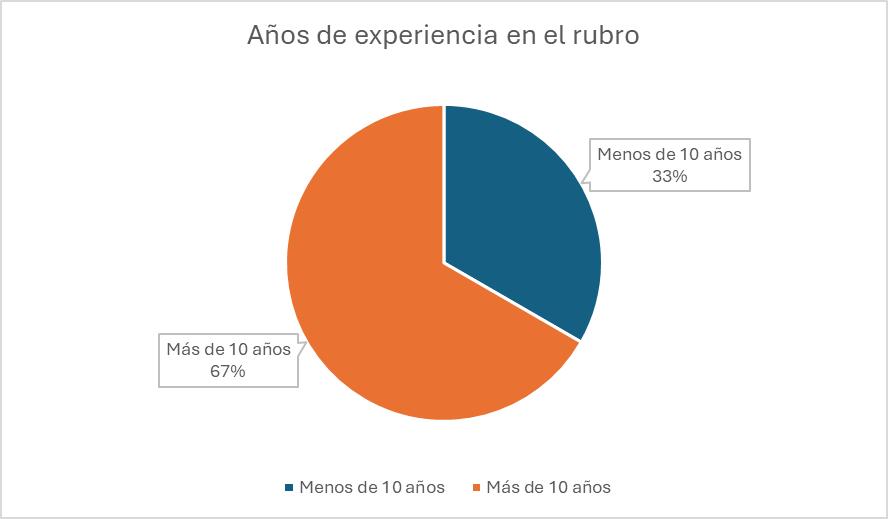
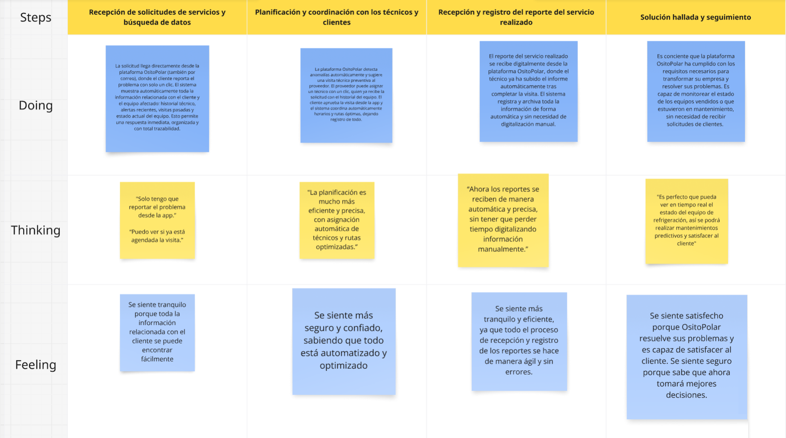

 <h1>Universidad Peruana de Ciencias Aplicadas</h1>
 
  <h2>Carrera: Ingeniería de Software</h2>
  <h2>Ciclo: 2025-1</h2>
 
  <h2>Curso: 1ASI0730 Aplicaciones Web</h2>
  <h2>Sección: 4378</h2>
  <h2>Profesor: Angel Augusto Velasquez Nuñez</h2>
 
 <h1>Informe TB1</h1>
  <h2>Startup: OsitoPolar</h2>
  <h2>Producto: Coolfreez</h2>
 
  <h2>Integrantes</h2>
<ul style="list-style: none;">
  <li><h3>U202222001 Aliaga Urbina Wilder Gonzalo</h3></li>
  <li><h3>U202220138 Ramírez Cabrera Kenyi Efraín</h3></li>
  <li><h3>U202223286 Rodriguez Parco Joseph Pablo</h3></li>
  <li><h3>U202123655 Rojas Reategui Victor Manuel</h3></li>
  <li><h3>U20221e617 Verona Flores Italo Sebastián</h3></li>
</ul>
 
   <h3>Abril 2025</h3>

## Registro de Versiones del Informe

| Versión | Fecha       | Autor        | Descripción de modificación         |
|---------|-------------|--------------|-------------------------------------|
| 0.1     |             |              |                                     |

## Project Report Collaboration Insights
URL de la organización del proyecto:

URL del repositorio del informe del proyecto:

## Contenido

- [Student Outcome](#student-outcome)

- [Capítulo I: Introducción](#c1)
    - [1.1. Startup Profile](#11-startup-profile)
        - [1.1.1. Descripción de la Startup](#111-descripción-de-la-startup)
        - [1.1.2. Perfiles de integrantes del equipo](#112-perfiles-de-integrantes-del-equipo)
    - [1.2. Solution Profile](#12-solution-profile)
        - [1.2.1 Antecedentes y problemática](#121-antecedentes-y-problemática)
        - [1.2.2 Lean UX Process](#122-lean-ux-process)
            - [1.2.2.1. Lean UX Problem Statements](#1221-lean-ux-problem-statements)
            - [1.2.2.2. Lean UX Assumptions](#1222-lean-ux-assumptions)
            - [1.2.2.3. Lean UX Hypothesis Statements](#1223-lean-ux-hypothesis-statements)
            - [1.2.2.4. Lean UX Canvas](#1224-lean-ux-canvas)
    - [1.3. Segmentos objetivo](#13-segmentos-objetivo)

- [Capítulo II: Requirements Elicitation & Analysis](#c2)
    - [2.1. Competidores](#21-competidores)
        - [2.1.1. Análisis competitivo](#211-análisis-competitivo)
        - [2.1.2. Estrategias y tácticas frente a competidores](#212-estrategias-y-tácticas-frente-a-competidores)
    - [2.2. Entrevistas](#22-entrevistas)
        - [2.2.1. Diseño de entrevistas](#221-diseño-de-entrevistas)
        - [2.2.2. Registro de entrevistas](#222-registro-de-entrevistas)
        - [2.2.3. Análisis de entrevistas](#223-análisis-de-entrevistas)
    - [2.3. Needfinding](#23-needfinding)
        - [2.3.1. User Personas](#231-user-personas)
        - [2.3.2. User Task Matrix](#232-user-task-matrix)
        - [2.3.3. User Journey Mapping](#233-user-journey-mapping)
        - [2.3.4. Empathy Mapping](#234-empathy-mapping)
        - [2.3.5. As-is Scenario Mapping](#235-as-is-scenario-mapping)
    - [2.4. Ubiquitous Language](#24-ubiquitous-language)

- [Capítulo III: Requirements Specification](#c3)
    - [3.1. To-Be Scenario Mapping](#31-to-be-scenario-mapping)
    - [3.2. User Stories](#32-user-stories)
    - [3.3. Impact Mapping](#33-impact-mapping)
    - [3.4. Product Backlog](#34-product-backlog)

- [Capítulo IV: Product Design](#c4)
    - [4.1. Style Guidelines](#41-style-guidelines)
        - [4.1.1. General Style Guidelines](#411-general-style-guidelines)
        - [4.1.2. Web Style Guidelines](#412-web-style-guidelines)
    - [4.2. Information Architecture](#42-information-architecture)
        - [4.2.1. Organization Systems](#421-organization-systems)
        - [4.2.2. Labeling Systems](#422-labeling-systems)
        - [4.2.3. SEO Tags and Meta Tags](#423-seo-tags-and-meta-tags)
        - [4.2.4. Searching Systems](#424-searching-systems)
        - [4.2.5. Navigation Systems](#425-navigation-systems)
    - [4.3. Landing Page UI Design](#43-landing-page-ui-design)
        - [4.3.1. Landing Page Wireframe](#431-landing-page-wireframe)
        - [4.3.2. Landing Page Mock-up](#432-landing-page-mock-up)
    - [4.4. Web Applications UX/UI Design](#44-web-applications-uxui-design)
        - [4.4.1. Web Applications Wireframes](#441-web-applications-wireframes)
        - [4.4.2. Web Applications Wireflow Diagrams](#442-web-applications-wireflow-diagrams)
        - [4.4.3. Web Applications Mock-ups](#443-web-applications-mock-ups)
        - [4.4.4. Web Applications User Flow Diagrams](#444-web-applications-user-flow-diagrams)
    - [4.5. Web Applications Prototyping](#45-web-applications-prototyping)
    - [4.6. Domain-Driven Software Architecture](#46-domain-driven-software-architecture)
        - [4.6.1. Software Architecture Context Diagram](#461-software-architecture-context-diagram)
        - [4.6.2. Software Architecture Container Diagrams](#462-software-architecture-container-diagrams)
        - [4.6.3. Software Architecture Components Diagrams](#463-software-architecture-components-diagrams)
    - [4.7. Software Object-Oriented Design](#47-software-object-oriented-design)
        - [4.7.1. Class Diagrams](#471-class-diagrams)
        - [4.7.2. Class Dictionary](#472-class-dictionary)
    - [4.8. Database Design](#48-database-design)
        - [4.8.1. Database Diagram](#481-database-diagram)

- [Capítulo V: Product Implementation, Validation & Deployment](#c5)
    - [5.1. Software Configuration Management](#51-software-configuration-management)
        - [5.1.1. Software Development Environment Configuration](#511-software-development-environment-configuration)
        - [5.1.2. Source Code Management](#512-source-code-management)
        - [5.1.3. Source Code Style Guide & Conventions](#513-source-code-style-guide--conventions)
        - [5.1.4. Software Deployment Configuration](#514-software-deployment-configuration)
    - [5.2. Landing Page, Services & Applications Implementation](#52-landing-page-services--applications-implementation)
        - [5.2.1. Sprint 1](#521-sprint-1)
            - [5.2.1.1. Sprint Planning 1](#5211-sprint-planning-1)
            - [5.2.1.2. Aspect Leaders and Collaborators](#5212-aspect-leaders-and-collaborators)
            - [5.2.1.3. Sprint Backlog 1](#5213-sprint-backlog-1)
            - [5.2.1.4. Development Evidence for Sprint Review](#5214-development-evidence-for-sprint-review)
            - [5.2.1.5. Execution Evidence for Sprint Review](#5215-execution-evidence-for-sprint-review)
            - [5.2.1.6. Services Documentation Evidence for Sprint Review](#5216-services-documentation-evidence-for-sprint-review)
            - [5.2.1.7. Software Deployment Evidence for Sprint Review](#5217-software-deployment-evidence-for-sprint-review)
            - [5.2.1.8. Team Collaboration Insights during Sprint](#5218-team-collaboration-insights-during-sprint)

=======
          

- [Conclusiones](#conclusiones)
- [Bibliografía](#bibliografía)
- [Anexos](#anexos)

## Student Outcome
El curso contribuye al cumplimiento del Student Outcome ABET:

**ABET – EAC - Student Outcome 5**

**Criterio**: *La capacidad de funcionar efectivamente en un equipo cuyos miembros
juntos proporcionan liderazgo, crean un entorno de colaboración e inclusivo,
establecen objetivos, planifican tareas y cumplen objetivos.*

En el siguiente cuadro se describe las acciones realizadas y enunciados de
conclusiones por parte del grupo, que permiten sustentar el haber alcanzado el logro
del ABET – EAC - Student Outcome 5.

<table>
  <tr>
    <th>Criterio específico</th>
    <th>Acciones realizadas</th>
    <th>Conclusiones</th>
  </tr>
  <tr>
    <td>Trabaja en equipo para proporcionar liderazgo en forma conjunta.</td>
    <td>
 
 
 
 
    <td>
</td>
  </tr>
  <tr>
    <td>Crea un entorno colaborativo e inclusivo, establece metas, planifica tareas y cumple objetivos.</td>
    <td>
 
 
 
    </td>
    <td>
</td>
  </tr>
</table>

## Capítulo I: Introducción 

### 1.1. Startup Profile
#### 1.1.1. Descripción de la Startup
#### 1.1.2. Perfiles de integrantes del equipo

### 1.2. Solution Profile
#### 1.2.1 Antecedentes y problemática
#### 1.2.2 Lean UX Process.
##### 1.2.2.1. Lean UX Problem Statements.
##### 1.2.2.2. Lean UX Assumptions.
##### 1.2.2.3. Lean UX Hypothesis Statements.
##### 1.2.2.4. Lean UX Canvas.
### 1.3. Segmentos objetivo.

## Capítulo II: Requirements Elicitation & Analysis 

### 2.1. Competidores

#### 2.1.1. Análisis competitivo
#### 2.1.2. Estrategias y tácticas frente a competidores
### 2.2. Entrevistas.
#### 2.2.1. Diseño de entrevistas
#### 2.2.2. Registro de entrevistas
#### 2.2.3. Análisis de entrevistas
### 2.3. Needfinding.
#### 2.3.1. User Personas.
#### 2.3.2. User Task Matrix.
#### 2.3.3. User Journey Mapping.
#### 2.3.4. Empathy Mapping.
#### 2.3.5. As-is Scenario Mapping.
### 2.4. Ubiquitous Language.

=======

**Competidor 1: ServiceTitan**
ServiceTitan es una plataforma de gestión de servicios basada en la nube que ofrece soluciones de software para empresas de servicios, incluidos técnicos de HVAC, fontaneros y electricistas. Proporciona funcionalidades de programación, gestión de trabajos, facturación y más. Esta plataforma es conocida por su facilidad de uso y por ayudar a las empresas a optimizar sus operaciones de servicio técnico en tiempo real.

---

**Competidor 2: CoolMaster**
CoolMaster es una solución de software diseñada específicamente para el sector de refrigeración comercial. Ofrece monitoreo remoto de sistemas de refrigeración, alertas tempranas de fallas y gestión eficiente del consumo energético. La plataforma está orientada a optimizar la eficiencia operativa de negocios que dependen críticamente de sistemas de frío, como supermercados y centros de distribución.

---

**Competidor 3: TempGenius**
TempGenius es un software de monitoreo de temperatura y humedad en tiempo real para diversas industrias, incluida la de la refrigeración comercial. Permite a los usuarios realizar un seguimiento de sus equipos de refrigeración mediante sensores conectados a la nube, generar reportes y recibir alertas automáticas por variaciones en los niveles de temperatura. Su principal enfoque es mejorar la visibilidad y control de las operaciones de refrigeración para evitar pérdidas económicas.

#### 2.1.1. Análisis competitivo

<table> 
  <tr>
    <th colspan="7"> Competitive Analysis Landscape </th>
  </tr>
  <tr>
    <td colspan="2" rowspan="2">¿Por qué llevar acabo este análisis? </td>
    <td colspan="5"> Pregunta </td>
  </tr>
  <tr>
    <td colspan="5"> Respuesta </td>
  </tr>
  <tr>
    <td colspan="2"> Productos </td>
    <td> OsitoPolar </td>
    <td> ServiceTitan </td>
    <td> CoolMaster </td>
    <td> TempGenius </td>
  </tr>
  <tr>
    <td rowspan="2">Perfil</td>
    <td>Overview</td>
    <td> OsitoPolar es una plataforma integral de monitoreo y gestión para sistemas de refrigeración, que conecta negocios con técnicos especializados. Ofrece monitoreo en tiempo real, alertas automáticas, mantenimiento preventivo, y trazabilidad de cada equipo. </td>
    <td> ServiceTitan es una plataforma de gestión de servicios basada en la nube que ofrece soluciones de software para empresas de servicios, incluidos técnicos de HVAC, fontaneros y electricistas. </td>
    <td> CoolMaster es una solución de software diseñada específicamente para el sector de refrigeración comercial. Ofrece monitoreo remoto de sistemas de refrigeración, alertas preventivas y gestión energética. </td>
    <td> TempGenius es un software de monitoreo de temperatura y humedad en tiempo real para diversas industrias, incluida la refrigeración comercial. Permite a los usuarios gestionar y recibir alertas automáticas sobre sus equipos. </td>
  </tr>
  <tr>
    <td>Ventaja competitiva ¿Qué valor ofrece a los clientes?</td>
    <td> Ofrece una solución automatizada y centralizada para negocios que necesitan monitorear y gestionar sus equipos de refrigeración. Permite a los técnicos optimizar sus visitas y el mantenimiento preventivo, mejorando la eficiencia operativa. </td>
    <td> Ofrece una plataforma todo-en-uno para la gestión de servicios con características como la programación de citas, facturación y seguimiento en tiempo real de proyectos. </td>
    <td> Ofrece soluciones específicas para la gestión de sistemas de refrigeración, con funcionalidades avanzadas de monitoreo, alertas y análisis de consumo energético. </td>
    <td> Ofrece monitoreo preciso en tiempo real de la temperatura y humedad, con alertas automáticas, y un enfoque especial en la fiabilidad y precisión de los datos. </td>
  </tr>
  <tr>
    <td rowspan="2">Perfil de Marketing</td>
    <td> Mercado Objetivo </td>
    <td> Negocios que dependen de sistemas de refrigeración, como supermercados, minimarkets, laboratorios, restaurantes, entre otros. También incluye técnicos de refrigeración y proveedores de equipos. </td>
    <td> Empresas de servicios como HVAC, fontaneros, electricistas, y otros proveedores de servicios técnicos. </td>
    <td> Negocios que dependen de sistemas de refrigeración como supermercados, laboratorios, restaurantes y otros en el sector alimentario y farmacéutico. </td>
    <td> Usuarios de diversas industrias, especialmente en áreas que requieren monitoreo continuo de temperatura y humedad, como el sector alimentario y farmacéutico. </td>
  </tr>
  <tr>
    <td> Estrategias de Marketing </td>
    <td> Marketing digital, colaboraciones estratégicas con empresas del sector alimentario y farmacéutico, demostraciones gratuitas y promociones en redes sociales. </td>
    <td> Marketing digital, colaboraciones con empresas de servicios y promoción en plataformas de negocio. </td>
    <td> Marketing dirigido a negocios en el sector alimentario y farmacéutico, con énfasis en la reducción de fallas y el ahorro energético. </td>
    <td> Marketing en redes sociales, promociones para nuevos usuarios y colaboraciones con industrias reguladas como la farmacéutica y alimentaria. </td>
  </tr>
  <tr>
    <td rowspan="3">Perfil de Producto</td>
    <td> Productos & Servicios </td>
    <td> Gestión de equipos de refrigeración en tiempo real, alertas automáticas, mantenimiento preventivo, reportes técnicos automáticos y trazabilidad de cada equipo. </td>
    <td> Plataforma de gestión de servicios que incluye programación de citas, gestión de personal, facturación, y seguimiento de proyectos en tiempo real. </td>
    <td> Plataforma de monitoreo y gestión de sistemas de refrigeración, con alertas preventivas, informes automáticos y análisis de rendimiento energético. </td>
    <td> Plataforma de monitoreo de temperatura y humedad en tiempo real, con alertas automáticas, reportes detallados y gestión de datos históricos. </td>
  </tr>
  <tr>
    <td> Precios & Costos </td>
    <td> Modelo basado en comisiones bajas por cada reserva o cita pagada para negocios, con una versión gratuita para usuarios. </td>
    <td> Suscripción mensual o anual, con tarifas adicionales por características avanzadas o soporte personalizado. </td>
    <td> Varía según el plan y características seleccionadas, con opciones para negocios grandes o pequeños. </td>
    <td> Varía según la cantidad de equipos monitoreados y las características seleccionadas, con modelos de suscripción mensual o anual. </td>
  </tr>
  <tr> 
    <td>Canales de distribución (Web y/o Móvil)</td>
    <td> Plataforma en línea y aplicación móvil disponible para dispositivos iOS y Android. </td>
    <td> Plataforma en línea y aplicación móvil disponible para dispositivos iOS y Android. </td>
    <td> Plataforma en línea y aplicación móvil. </td>
    <td> Aplicación móvil disponible en tiendas de aplicaciones y plataforma en línea. </td>
  </tr>
  <tr>
    <td rowspan="4"> Análisis SWOT </td>
    <td> Fortalezas </td>
    <td> Monitoreo en tiempo real, alertas automáticas y mantenimiento preventivo para evitar fallas críticas. Función de trazabilidad completa de los equipos. </td>
    <td> Amplia funcionalidad para gestión de servicios y seguimiento en tiempo real de proyectos. </td>
    <td> Especialización en el monitoreo y la gestión de sistemas de refrigeración, con enfoque en ahorro energético. </td>
    <td> Precisión en el monitoreo de temperatura y humedad, con alertas automáticas y un enfoque flexible en diferentes industrias. </td>
  </tr>
  <tr>
    <td> Debilidades </td>
    <td> Dependencia de la adopción inicial por parte de los usuarios, lo que podría afectar la expansión. </td>
    <td> Puede ser más complejo de usar para pequeñas empresas sin experiencia en gestión de software. </td>
    <td> Enfoque limitado al sector de refrigeración, lo que puede dificultar la expansión a otros mercados. </td>
    <td> Puede resultar costoso para pequeñas empresas debido a las suscripciones y los costos adicionales por dispositivos. </td>
  </tr>
  <tr>
    <td> Oportunidades </td>
    <td> Expansión en el sector de la gestión de refrigeración, con foco en la eficiencia operativa y la reducción de costos. </td>
    <td> Expansión a nuevos mercados, introducción de nuevos servicios, mejorar la experiencia del usuario. </td>
    <td> Expansión a nuevos mercados, mejora continua de características y funciones, colaboraciones estratégicas con otros servicios. </td>
    <td> Expansión a nuevos mercados, introducción de nuevas características y servicios, colaboraciones estratégicas con marcas de belleza. </td>
  </tr>
  <tr>
    <td> Amenazas </td>
    <td> Competencia de aplicaciones ya establecidas en la gestión de refrigeración y mantenimiento. </td>
    <td> Competencia de otras plataformas de gestión de servicios que ofrecen características similares. </td>
    <td> Alta competencia en el mercado de soluciones para refrigeración y dependencia de la infraestructura de clientes. </td>
    <td> Competencia de otras plataformas de monitoreo de temperatura y humedad, con características similares y precios más bajos. </td>
  </tr>
</table>

#### 2.1.2. Estrategias y tácticas frente a competidores

Hemos identificado diversas estrategias y tácticas para diferenciarse y competir efectivamente con otros actores del mercado de la gestión y monitoreo de sistemas de refrigeración. A continuación se detallan las principales:

---

**1. Estrategias de Diferenciación:**

- **Automatización y Mantenimiento Preventivo**: A diferencia de los competidores, **OsitoPolar** se enfoca en ofrecer una solución integral con monitoreo en tiempo real, alertas automáticas y un sistema de mantenimiento preventivo. Esto permite a los negocios reducir las incidencias por fallas inesperadas y gestionar sus equipos de refrigeración de manera proactiva.

- **Trazabilidad Completa de Equipos**: Ofrecemos una plataforma que proporciona un historial técnico detallado de cada equipo, algo que competidores como **ServiceTitan** no ofrecen de forma especializada para el sector de refrigeración. Esto garantiza un mayor control sobre los activos y la calidad del servicio.

- **Interfaz Intuitiva y Fácil de Usar**: A diferencia de **CoolMaster**, que se centra más en el sector de refrigeración sin necesariamente pensar en la accesibilidad del usuario, **OsitoPolar** prioriza la simplicidad de uso, lo que facilita la adopción rápida por parte de los negocios y técnicos, independientemente de su experiencia tecnológica.

---

**2. Tácticas de Marketing:**

- **Marketing Digital y Demostraciones Gratuitas**: Enfocaremos nuestras campañas en redes sociales, demostraciones en vivo, y colaboraciones con negocios del sector alimentario y farmacéutico, destacando nuestra capacidad para reducir fallas y ahorrar costos en operaciones. Esta táctica se diferencia de **TempGenius**, que aún no ha adoptado un enfoque digital tan agresivo.

- **Fidelización de Usuarios a Largo Plazo**: Implementaremos programas de fidelización y un sistema de recompensas para los técnicos y negocios que continúen usando nuestra plataforma y colaboren con nosotros para mejorar el servicio. De esta forma, buscamos aumentar la lealtad, algo que muchos competidores no han logrado gestionar adecuadamente.

---

**3. Estrategias de Precios:**

- **Modelo Freemium**: Ofrecemos una versión básica gratuita para atraer a pequeños negocios y usuarios que no están seguros de pagar por un servicio premium de inmediato. Este modelo es más flexible que el de **ServiceTitan**, que depende de suscripciones pagadas desde el principio.

- **Comisiones Bajas por Reserva**: Para los negocios, aplicamos comisiones reducidas por cada cita reservada a través de nuestra plataforma, lo que facilita la adopción, especialmente en comparación con otros competidores como **CoolMaster**, que tiene costos fijos más elevados.

---

**4. Expansión y Adaptabilidad:**

- **Enfoque Regional Inicial y Expansión Nacional**: A diferencia de competidores como **TempGenius**, que tiene un enfoque global, **OsitoPolar** comenzará en Lima con planes de expansión a otras ciudades del Perú. Esto nos permite adaptarnos mejor a las necesidades locales antes de expandirnos a nivel internacional.

- **Colaboraciones con Proveedores Locales**: Formaremos alianzas estratégicas con proveedores de equipos de refrigeración y servicios técnicos en Perú, lo que nos diferenciará de la competencia al contar con un sistema robusto y adaptado específicamente para el mercado peruano.

---

### 2.2. Entrevistas.

#### 2.2.1. Diseño de entrevistas

**Segmento 1: Negocios que utilizan equipos de refrigeración**

1. ¿Qué edad tiene?
2. ¿De dónde es y a qué se dedica?
3. ¿Qué tipo de negocio tiene y qué productos necesita mantener en frío?
4. ¿Cuántos equipos de refrigeración tiene actualmente?
5. ¿Ha tenido pérdidas por fallas en sus equipos? ¿Qué impacto tuvo?
6. ¿Cómo monitorea hoy el estado (temperatura, consumo, fallas) de esos equipos?
7. ¿Con qué frecuencia realiza mantenimiento y quién se encarga?
8. ¿Utiliza alguna herramienta digital para la gestión de estos equipos?
9. ¿Qué tan útil le parecería recibir alertas automáticas por fallas o variaciones de temperatura?
10. ¿Le interesaría tener un historial técnico y reportes automáticos por cada equipo?
11. ¿Estaría dispuesto a pagar una suscripción si esto evita pérdidas y mejora la eficiencia?
12. ¿Qué funcionalidades sí o sí debería tener una herramienta de este tipo para que usted la use?
13. ¿Preferiría acceder a la herramienta desde su celular o computadora?
14. ¿Qué le haría dejar de usar una aplicación de este tipo?

**Segmento 2: Empresas proveedoras de servicios y equipos de refrigeración**

1. ¿Qué edad tiene?
2. ¿De dónde es?
3. ¿A qué se dedica específicamente y hace cuánto trabaja en el rubro?
4. ¿Cuántos clientes o negocios atiende regularmente?
5. ¿Cómo organiza sus visitas técnicas y mantenimientos?
6. ¿Lleva un historial técnico de los equipos que repara? ¿Cómo lo gestiona?
7. ¿Cuáles son las principales dificultades que enfrenta su empresa al coordinar servicios técnicos?
8. ¿Cómo coordina hoy sus rutas o visitas? ¿Utiliza alguna herramienta o lo hace manualmente?
9. ¿Qué tan útil le sería tener una app donde pueda ver todos los equipos que provee o atiende?
10. ¿Le interesaría recibir alertas sobre fallas en los equipos de sus clientes en el momento en el que suceden?
11. ¿Qué tanto valora poder generar reportes automáticos y mantener trazabilidad de cada intervención?
12. ¿Estaría dispuesto a usar una plataforma que le ayude a organizarse mejor y escalar su servicio?
13. ¿Ha probado alguna solución parecida antes? ¿Por qué la dejó de usar (si la dejó)?
14. ¿Qué beneficios cree que podría tener la implementación de una solución digital como OsitoPolar a su empresa?

---
#### 2.2.2. Registro de entrevistas

##### Segmento objetivo #1: Negocios que utilizan equipos de refrigeración

---
#### Entrevista 1:

- **Nombres y apellidos:** Adriana Moloche
- **Edad:** 32
- **Distrito:** San Martín de Porres

- 

- **Inicio:** 0:02
- **Duración:** 3:18 min
- **URL:** https://upcedupe-my.sharepoint.com/:v:/g/personal/u202220138_upc_edu_pe/EUSnM9J2IAJHggHYL2AGJEIBWavDtsQsp8swvVetaNGNOQ?e=0TNgA1&nav=eyJyZWZlcnJhbEluZm8iOnsicmVmZXJyYWxBcHAiOiJTdHJlYW1XZWJBcHAiLCJyZWZlcnJhbFZpZXciOiJTaGFyZURpYWxvZy1MaW5rIiwicmVmZXJyYWxBcHBQbGF0Zm9ybSI6IldlYiIsInJlZmVycmFsTW9kZSI6InZpZXcifX0%3D
- **Resumen:** Adriana es emprendedora y dueña de una bodega tipo mini market, donde conserva productos como embutidos, gaseosas, aguas y otras bebidas en frío. Actualmente cuenta con dos equipos de refrigeración y ha experimentado pérdidas debido a fallas en sus equipos. Para monitorear el estado de estos, revisa manualmente la temperatura y el consumo de energía diariamente, y realiza el mantenimiento cada 20 días.
  No utiliza herramientas digitales para gestionar sus equipos, pero considera que sería completamente útil recibir alertas por fallas, variaciones de temperatura o consumo de energía. Además, le interesaría contar con un historial técnico y reportes automáticos por equipo tras cada servicio de mantenimiento, y estaría dispuesta a pagar una suscripción si esto le ayuda a evitar pérdidas.
  Para Adriana, una herramienta digital ideal debe incluir funcionalidades como control de temperatura y monitoreo de electricidad. Sin embargo, el precio sería un factor clave que podría desmotivarla a usarla; por ello, considera necesario probar un demo previo y tener planes de suscripción adaptables, ya sean mensuales o anuales.

---
#### Entrevista 2:
- **Nombres y apellidos:** Luis Mamani Torres
- **Edad:** 37
- **Distrito:** Comas

- **Inicio:** 0:25
- **Duración:** 9:03 min
- **URL:** https://upcedupe-my.sharepoint.com/:v:/g/personal/u202223286_upc_edu_pe/EZpUpn4-Z8lEi6EC5ARiL_IBd8r8a3gLXm2QQ0OMfL59dw?nav=eyJyZWZlcnJhbEluZm8iOnsicmVmZXJyYWxBcHAiOiJPbmVEcml2ZUZvckJ1c2luZXNzIiwicmVmZXJyYWxBcHBQbGF0Zm9ybSI6IldlYiIsInJlZmVycmFsTW9kZSI6InZpZXciLCJyZWZlcnJhbFZpZXciOiJNeUZpbGVzTGlua0NvcHkifX0&e=o03M2P
- **Resumen:** Luis Mamani, es un emprendedor dueño de una cevichería muy bien calificada por los vecinos de Comas, ex trabajador coordinador de platos marinos en hoteles como el Sheraton, entre otros más, encargado de control de cocina en diversos restaurantes del Perú.
  Actualmente, cuenta con equipos de refrigeración ya que para el rubro marino, todo debe estár en refrigeración, Luis recalca la diferencia entre refrigeración y congelación, porque en cevichería pocas cosas pueden estár congeladas, pero muchas pueden estár congeladas porque se toman como pérdidas.
  Para Luis esta herramienta le ayudaría si tuviera que estár pendiente de muchos locales de cevicherías o así, ahora que él tiene un solo local, el se encarga de todo pero aclara la importancia que esto tiene a gran escala. Para Luis ahora el produto es interesante, está interesado en usarlo si tuviese garn escala.
  Como ahora no lo tiene, quisiera usarlo para tener un control de los productos que tiene, y así no perderlos, ya que el ceviche es un producto muy delicado.
  Luis menciona que no tiene un sistema de refrigeración, pero que le gustaría tenerlo, ya que ahora tiene un sistema de refrigeración, pero no tiene un sistema de monitoreo. Luis menciona que no tiene un sistema de monitoreo, pero que le gustaría tenerlo, ya que ahora tiene un sistema de monitoreo, pero no tiene un sistema de refrigeración.
  Luis comenta que las empresas de refrigeración como avicolas, tienen estos sitemas pero no de manera tan sofiscticada como nuestra propuesta lo que realza valor en nuestro producto, que también dice que estarían dispuestos según su conocimiento a pagar, él también si tuviera una producción masiva.

##### Segmento objetivo #2: Empresas proveedoras de servicios y equipos de refrigeración

---
#### Entrevista 1:

- **Nombres y apellidos:** Wilder Canchan
- **Edad:** 45
- **Distrito:** Los Olivos

- 

- **Inicio:** 0:43
- **Duración:** 7:03 min
- **URL:** https://upcedupe-my.sharepoint.com/:v:/g/personal/u202220138_upc_edu_pe/ES1Kw9TJaNZGszXWCTKRDwMBAXSTN5Xfq1nkndAnOnWqzA?e=4eLG4i&nav=eyJyZWZlcnJhbEluZm8iOnsicmVmZXJyYWxBcHAiOiJTdHJlYW1XZWJBcHAiLCJyZWZlcnJhbFZpZXciOiJTaGFyZURpYWxvZy1MaW5rIiwicmVmZXJyYWxBcHBQbGF0Zm9ybSI6IldlYiIsInJlZmVycmFsTW9kZSI6InZpZXcifX0%3D
- **Resumen:** Wilder es un empresario con 7 años de experiencia en mantenimiento de equipos de refrigeración y aire acondicionado. Él atiende entre 20 a 25 clientes al mes, principalmente restaurantes, bares y bodegas. En cuanto a la atención al cliente, su empresa solo utiliza un número telefónico para coordinar las visitas técnicas. Una de las dificultades que enfrenta su empresa es la mala coordinación entre el cliente y el servidor de mantenimiento en cuanto al punto de llegada. Esto se debe a la imprecisión de la ubicación que brindan ciertas herramientas de software y el tráfico vehicular. Su equipo técnico utiliza Google Maps para planificar rutas. Wilder considera útil una aplicación que le ayude a mejorar la gestión de los equipos de mantenimiento y de los técnicos, con reportes de fallas en tiempo real y mejor comunicación con el cliente. Él cree que el impacto de una aplicación así sería muy positiva, pues mejoraría la precisión de los servicios y conseguiría la satisfacción de sus clientes.

---

#### Entrevista 2:

- **Nombres y apellidos:** Jackeline Bravo
- **Edad:** 36
- **Distrito:** Comas

- 

- **Inicio:** 0:30
- **Duración:** 5:48 min
- **URL:** https://upcedupe-my.sharepoint.com/:v:/g/personal/u202220138_upc_edu_pe/EcXJ53phM5tErK0_8ysM4ZMBiNklNpj06tU3JQk9_GmjnQ?e=MwcjYd&nav=eyJyZWZlcnJhbEluZm8iOnsicmVmZXJyYWxBcHAiOiJTdHJlYW1XZWJBcHAiLCJyZWZlcnJhbFZpZXciOiJTaGFyZURpYWxvZy1MaW5rIiwicmVmZXJyYWxBcHBQbGF0Zm9ybSI6IldlYiIsInJlZmVycmFsTW9kZSI6InZpZXcifX0%3D
- **Resumen:** Jackeline es una empresaria dedicada en el área administrativa con 13 años de experiencia en el rubro de servicios y equipos de refrigeración. Actualmente atiende a dos clientes fijos y varios temporales, incluyendo servicios preventivos trimestrales y activaciones de equipos los fines de semana. Para gestionar el historial técnico de los equipos que provee o repara, utiliza hojas de cálculo en Excel. Una de las dificultades que enfrenta su empresa es la falta de un software que permita visualizar información en tiempo real, lo que impacta en la eficiencia y calidad del servicio. Para la planificación de rutas, su equipo técnico usa aplicaciones como Maps y cronogramas proporcionados por los clientes. Jacqueline considera que sería muy útil contar con una aplicación digital que optimice la gestión de datos, permita el ingreso de información en tiempo real desde dispositivos móviles, y facilite la recepción de alertas técnicas de fallas en los equipos.
  Según ella, el impacto de una solución digital sería significativo, pues ahorraría tiempo, eliminaría procesos manuales, mejoraría la calidad del servicio, y aumentaría la satisfacción de sus clientes.

---

#### Entrevista 3:

- **Nombres y apellidos:** Santiago Vique
- **Edad:** 48
- **Distrito:** San Martín de Porres

- 

- **Inicio:** 0:11
- **Duración:** 7:09 min
- **URL:** https://upcedupe-my.sharepoint.com/:v:/g/personal/u202220138_upc_edu_pe/EfsC5pRPvnVFovKrip9liqwB6Eea4CGfHAiILJt8Yn-H1w?e=881RuS&nav=eyJyZWZlcnJhbEluZm8iOnsicmVmZXJyYWxBcHAiOiJTdHJlYW1XZWJBcHAiLCJyZWZlcnJhbFZpZXciOiJTaGFyZURpYWxvZy1MaW5rIiwicmVmZXJyYWxBcHBQbGF0Zm9ybSI6IldlYiIsInJlZmVycmFsTW9kZSI6InZpZXcifX0%3D
- **Resumen:** Santiago es dueño de una empresa de venta y mantenimiento de equipos de refrigeración e instalación de cámaras frigoríficas, con 12 años de experiencia. Atiende principalmente a dos grandes clientes, el Grupo Backus y el Grupo Mambrino, y algunos clientes ambulatorios. Actualmente, no utiliza un sistema digital para gestionar el historial técnico de los equipos más allá de informes en PDF y Excel. Una de sus principales dificultades es la falta de información clara sobre las fallas de los equipos cuando coordina los servicios, lo que dificulta la preparación adecuada de herramientas y repuestos. Además, la planificación de rutas se realiza de manera manual, usando WhatsApp y Google Maps, lo que limita la eficiencia en tiempo real.
  Santiago considera que una aplicación digital que permita gestionar equipos, recibir alertas sobre fallas y organizar las visitas técnicas mejoraría significativamente la eficiencia de su empresa. Cree que una solución digital reduciría costos, optimizaría el tiempo y mejoraría la calidad del servicio, lo que aumentaría la confianza y satisfacción de los clientes.

---

#### 2.2.3. Análisis de entrevistas
Basándonos en las entrevistas, hemos llevado a cabo un análisis en el que destacamos los puntos compartidos y tendencias comunes entre los usuarios.

**Segmento objetivo #2: EMPRESAS PROVEEDORAS DE SERVICIOS Y EQUIPOS DE REFRIGERACIÓN**

**Hallazgos:**
- Algunos tienen más de 10 años de experiencia en el rubro.
- Todos los entrevistados tienen como motivación principal brindar equipos de calidad y mejorar la eficiencia del servicio que ofrecen a sus clientes. Buscan optimizar los tiempos de respuesta y asegurar la satisfacción del cliente, especialmente en sectores que requieren atención técnica frecuente, como la refrigeración y el mantenimiento de equipos.
- Los entrevistados comparten una motivación común, aunque sus prioridades varían en áreas como la optimización de la gestión de datos, la precisión en las intervenciones y la atención al cliente.
- Todos mencionan que la coordinación de rutas es una dificultad, ya que actualmente se realiza de manera manual mediante WhatsApp, Google Maps, o cronogramas proporcionados por los clientes.
- Algunos se centran más en los problemas asociados a la gestión de datos, mientras que otros destacan las dificultades relacionadas con las ubicaciones imprecisas y el tráfico vehicular.
- La mayoría cree que a veces la labor ineficiente de coordinación del cliente es un problema, tanto para brindar su ubicación como para precisar la falla o problema de su equipo de refrigeración.
- La falta de un sistema digital que centralice y facilite el acceso a los datos de los equipos y las intervenciones es otra limitante que impacta en la eficiencia de sus operaciones.
- La mayoría de los entrevistados utilizan métodos tradicionales como Excel para gestionar el historial técnico de los equipos.
- Todos están interesados en recibir alertas sobre fallas en los equipos en tiempo real, lo que les permitiría responder más rápido y con mayor precisión a los problemas.
- Todos creen que una solución digital tendría un impacto positivo en su empresa.
- Algunos anticipan un mayor impacto positivo en áreas específicas, como una buena gestión de tiempo, la reducción de costos y el aumento de la satisfacción tanto de los clientes como de los técnicos con los que colaboran.
- Ninguno ha probado antes una solución digital que mejore la venta, gestión y mantenimiento de equipos de refrigeración más allá de las tradicionales.

**Análisis estadístico**

- Más del 50% de los empresarios tiene un número mayor a 10 años de experiencia en el rubro.

---

- Los empresarios tienen diferentes frecuencias de ciertas dificultades, a pesar de que tienen casi los mismos problemas.

---

- El 67% de los empresarios creen que el cliente es parcialmente causante de su problema de mayor frecuencia. Algunos de ellos han expresado su inconformidad respecto a los clientes que no explican bien las fallas de sus equipos.

---

- El 100% está interesado en recibir notificaciones sobre fallos que ocurren en equipos de refrigeración. Ellos creen que con dicha funcionalidad podrían hacer un mantenimiento preventivo más eficiente y lograr la satisfacción del cliente.

---

- Ni uno de los empresarios ha usado una plataforma digital que se asemeje a la que se muestran interesados. Ellos usaron aplicaciones para mejorar la eficiencia de su trabajo como WhatsApp y Maps o programas como Microsoft Excel. Sin embargo, estos no poseen todas las funcionalidades que necesitan.

---

- Cada empresario tiene una meta deseada de mayor prioridad diferente al resto a pesar de que todos ellos comparten los mismos deseos y esperan que una plataforma digital pueda ayudarles a obtenerlos.

---

### 2.3. Needfinding.

#### 2.3.1. User Personas.
En esta sección se presentan las fichas de User Personas construidas a partir de los datos recogidos del análisis de entrevistas al segmento #1: "Negocios que utilizan equipos de refrigeración" y al segmento #2: "Empresas proveedoras de servicios y equipos de refrigeración". Estas fichas permiten representar de forma clara y estratégica los perfiles del segmento objetivo, considerando sus metas, habilidades, motivaciones y dificultades. Al integrar tanto la perspectiva del usuario como las tendencias del sector, estas representaciones sirven como una herramienta clave para el diseño de soluciones digitales centradas en el usuario y alineadas con las oportunidades del mercado.

##### Segmento objetivo #1: Negocios que utilizan equipos de refrigeración

##### Segmento objetivo #2: Empresas proveedoras de servicios y equipos de refrigeración

#### 2.3.2. User Task Matrix.

En esta sección se presenta el User Task Matrix, construido a partir de los User Persona que representan a los dos segmentos clave identificados:

Segmento 1: Negocios que utilizan equipos de refrigeración (representado por Carolina García).

Segmento 2: Empresas proveedoras de servicios y equipos de refrigeración (representado por Luis Rojas).

Las tareas fueron identificadas a partir del análisis cualitativo de entrevistas, y cada una fue evaluada según su frecuencia y nivel de importancia para los respectivos perfiles.

<table>
  <tr>
    <th rowspan="2">Tarea / Task</th>
    <th colspan="2">Carolina García</th>
    <th colspan="2">Luis Rojas</th>
  </tr>
  <tr>
    <th>Frecuencia</th>
    <th>Importancia</th>
    <th>Frecuencia</th>
    <th>Importancia</th>
  </tr>
  <tr>
    <td>Detectar o identificar fallas en los equipos</td>
    <td>Baja</td>
    <td>Alta</td>
    <td>Alta</td>
    <td>Alta</td>
  </tr>
  <tr>
    <td>Coordinar servicios de mantenimiento</td>
    <td>Media</td>
    <td>Alta</td>
    <td>Alta</td>
    <td>Alta</td>
  </tr>
  <tr>
    <td>Planificar rutas de llegada al punto de atención</td>
    <td>Alta</td>
    <td>Media</td>
    <td>Baja</td>
    <td>Alta</td>
  </tr>
  <tr>
    <td>Realizar mantenimiento preventivo o solicitarlo</td>
    <td>Media</td>
    <td>Alta</td>
    <td>Alta</td>
    <td>Alta</td>
  </tr>
  <tr>
    <td>Gestionar datos de los equipos de refrigeración</td>
    <td>Baja</td>
    <td>Alta</td>
    <td>Alta</td>
    <td>Alta</td>
  </tr>
  <tr>
    <td>Gestionar costos por pérdidas de productos</td>
    <td>Alta</td>
    <td>Alta</td>
    <td>Media</td>
    <td>Media</td>
  </tr>
  <tr>
    <td>Evaluar la calidad de los equipos y servicios brindados</td>
    <td>Media</td>
    <td>Alta</td>
    <td>Media</td>
    <td>Alta</td>
  </tr>
  <tr>
    <td>Monitorear el desempeño de los técnicos</td>
    <td>Baja</td>
    <td>Media</td>
    <td>Alta</td>
    <td>Alta</td>
  </tr>
  <tr>
    <td>Monitorear el desempeño de los equipos brindados</td>
    <td>Alta</td>
    <td>Alta</td>
    <td>Baja</td>
    <td>Alta</td>
  </tr>
  <tr>
    <td>Usar reportes técnicos para tomar decisiones</td>
    <td>Baja</td>
    <td>Alta</td>
    <td>Media</td>
    <td>Alta</td>
  </tr>
  <tr>
    <td>Comunicar fallas al técnico o proveedor</td>
    <td>Alta</td>
    <td>Alta</td>
    <td>Media</td>
    <td>Alta</td>
  </tr>
</table>

**Análisis**

#### 2.3.3. User Journey Mapping.
**Segmento objetivo #1: Negocios que utilizan equipos de refrigeración**
Este User Journey Map representa el recorrido actual de Carolina García. El mapa ilustra su experiencia completa desde que maneja continuamente los datos registrados de la empresa hasta su seguimiento luego de la realización de la venta o servicio.
Esta sección refleja la situación actual sin intervención de soluciones tecnológicas, mostrando los puntos de contacto, tareas clave, emociones y posibles fricciones que enfrenta en su día a día. Este recorrido permite entender los desafíos que enfrenta Carolina.

**Segmento objetivo #2: EMPRESAS PROVEEDORAS DE SERVICIOS Y EQUIPOS DE REFRIGERACIÓN**

Este User Journey Map representa el recorrido actual de Luis Rojas. El mapa ilustra su experiencia completa desde que maneja continuamente los datos registrados de la empresa hasta su seguimiento luego de la realización de la venta o servicio.
Esta sección refleja la situación actual sin intervención de soluciones tecnológicas, mostrando los puntos de contacto, tareas clave, emociones y posibles fricciones que enfrenta en su día a día. Este recorrido permite entender los desafíos que enfrenta Luis.

#### 2.3.4. Empathy Mapping.

**Segmento objetivo #1: Negocios que utilizan equipos de refrigeración**

**Segmento objetivo #2: EMPRESAS PROVEEDORAS DE SERVICIOS Y EQUIPOS DE REFRIGERACIÓN**

#### 2.3.5. As-is Scenario Mapping.

En esta sección, nuestro equipo tomó en cuenta las etapas para su desarrollo. Iniciamos con la recolección de información proveniente de las entrevistas y análisis de estas de cada segmento respectivo, seguida de una lluvia de ideas, una revisión en conjunto e identificación de las fases y las áreas positivas y negativas.
Una vez definido todo, procedimos a crear los As-is Scenario Mapping vinculados a cada User Persona en la plataforma Miro.
Desde la perspectiva del usuario, este mapa nos permite visualizar su situación real: acciones actuales, emociones, pensamientos, puntos de dolor, etc.

**Segmento objetivo #2: EMPRESAS PROVEEDORAS DE SERVICIOS Y EQUIPOS DE REFRIGERACIÓN**

### 2.4. Ubiquitous Language.

1. **User (Usuario):** Negocios y técnicos del rubro de refrigeración que utilizan OsitoPolar para gestionar equipos de congelación, coordinar mantenimientos y optimizar sus operaciones.

2. **User Profile (Perfil de Usuario):** Datos e información operativa que OsitoPolar recopila de cada usuario para personalizar su experiencia.

3. **Smart Dashboard (Panel Inteligente):** Interfaz central donde los usuarios monitorean el estado de sus equipos, reciben alertas y gestionan sus servicios.

4. **Performance Report (Reporte de Rendimiento):** Informe técnico con historial de uso, consumo energético, temperatura y fallas de cada equipo.

5. **Maintenance Schedule (Agenda de Mantenimientos):** Calendario inteligente para programar mantenimientos preventivos o correctivos.

6. **Failure Alert (Alerta de Falla):** Notificación automática ante anomalías críticas como sobrecalentamiento o cortes de energía.

7. **Equipment Inventory (Inventario de Equipos):** Registro de todos los equipos de congelación con sus datos técnicos y ubicación.

8. **Service Provider (Proveedor de Servicio):** Técnico o empresa que brinda mantenimiento, instalación o reparación de equipos de refrigeración.

9. **Technical History (Historial Técnico):** Registro detallado de todas las intervenciones realizadas a un equipo.

10. **Work Order (Orden de Trabajo):** Documento digital con las tareas asignadas a un técnico para una visita de servicio.

11. **Service Coordination (Coordinación de Servicio):** Proceso de conexión entre clientes y proveedores según disponibilidad, ubicación y necesidad.

12. **Automatic Report Generation (Generación Automática de Reportes):** Función que crea informes técnicos sin intervención manual.

13. **Real-Time Monitoring (Monitoreo en Tiempo Real):** Supervisión constante del estado operativo del equipo (temperatura, consumo, uso).

14. **Service Zone (Zona de Servicio):** Área donde un proveedor puede atender equipos con rapidez y eficiencia.

15. **Client Portfolio (Cartera de Clientes):** Lista de negocios atendidos por un proveedor, con sus datos y equipos registrados.

16. **Cold Equipment (Equipo de Congelación):** Unidad de refrigeración usada para conservar productos, como congeladoras, cámaras o vitrinas.

17. **Energy Consumption (Consumo Energético):** Registro del uso eléctrico de los equipos para detectar anomalías y optimizar recursos.

18. **Preventive Maintenance (Mantenimiento Preventivo):** Servicio planificado para evitar fallas y extender la vida útil del equipo.

19. **Corrective Maintenance (Mantenimiento Correctivo):** Servicio realizado para solucionar una falla existente en un equipo.

20. **Notification (Notificación):** Mensajes enviados automáticamente para informar sobre mantenimientos, fallas o cambios importantes.

## Capítulo III: Requirements Specification 

### 3.1. To-Be Scenario Mapping.
**Segmento objetivo #1: CLIENTES (DUEÑOS DE EQUIPOS DE REFRIGERACIÓN)**

**Segmento objetivo #2: EMPRESAS PROVEEDORAS DE SERVICIOS Y EQUIPOS DE REFRIGERACIÓN**

### 3.2. User Stories.

Las historias de usuario desarrolladas en este proyecto fueron elaboradas en conjunto por el equipo de desarrollo de OsitoPolar, considerando las necesidades y funcionalidades clave tanto para los clientes (dueños de equipos de refrigeración) como para los empresarios (proveedores de equipos y servicios de mantenimiento y refrigeración). Las historias fueron organizadas bajo épicas que agrupan funcionalidades similares. Los criterios de aceptación de todas las historias siguen la sintaxis Gherkin.
El trabajo fue realizado de manera colaborativa, priorizando la comprensión del problema desde la perspectiva del usuario final. Para facilitar la organización, priorización y trazabilidad de las tareas, se utilizó la plataforma Trello

| **Epic / Story ID** | **Título**                                     | **Descripción**                                                                                                                                                            | **Criterios de Aceptación**                                                                                                                                                                                                                                                                                                                                                                                                                                                                                                                                                                                                                 | **Relacionado con (Epic ID)** |
|---------------------|------------------------------------------------|----------------------------------------------------------------------------------------------------------------------------------------------------------------------------|---------------------------------------------------------------------------------------------------------------------------------------------------------------------------------------------------------------------------------------------------------------------------------------------------------------------------------------------------------------------------------------------------------------------------------------------------------------------------------------------------------------------------------------------------------------------------------------------------------------------------------------------|-------------------------------|
| US-01               | Registro de usuario                            | Como nuevo usuario, quiero registrarme para acceder a la plataforma y empezar a gestionar mis equipos de refrigeración                                                     | **Escenario 1: Crear cuenta exitosamente**   Dado que el nuevo usuario tiene todos los datos correctos, cuando completa el formulario de registro, entonces su cuenta es creada correctamente.  **Escenario 2: Intento de crear cuenta con email ya registrado**  Dado que el nuevo usuario intenta registrarse con un correo ya registrado, cuando envía el formulario, entonces el sistema muestra un mensaje indicando que el correo ya existe.                                                                                                                                                                              | EP-01                         |
| US-02               | Inicio de sesión                               | Como usuario, quiero iniciar sesión con mi cuenta para acceder a la plataforma.                                                                                            | **Escenario 1: Iniciar sesión correctamente**   Dado que el usuario tiene una cuenta activa, cuando ingresa sus datos correctamente, entonces accede a su panel de control.  **Escenario 2: Intento de iniciar sesión con datos incorrectos**  Dado que el usuario ingresa datos incorrectos, cuando intenta iniciar sesión, entonces el sistema muestra un mensaje de error.                                                                                                                                                                                                                                                   | EP-01                         |
| US-03               | Solicitar servicio de reparación               | Como cliente, quiero poder solicitar un servicio de reparación para mis equipos de refrigeración cuando detecto fallas.                                                    | **Escenario 1: Solicitar servicio de reparación**   Dado que el cliente ha identificado una falla, cuando solicita el servicio desde la plataforma, entonces se genera la solicitud de servicio.  **Escenario 2: Confirmación de solicitud de servicio**  Dado que el cliente ha solicitado el servicio, cuando el sistema recibe la solicitud, entonces muestra un mensaje confirmando la recepción.                                                                                                                                                                                                                           | EP-03                         |
| US-04               | Ver estado del servicio solicitado             | Como cliente, quiero ver el estado actual de mi solicitud de servicio para estar informado sobre el avance del proceso.                                                    | **Escenario 1: Verificación del estado de la solicitud**   Dado que el cliente ha solicitado el servicio, cuando ingresa a la plataforma, entonces puede ver el estado actualizado de su solicitud.  **Escenario 2: Actualización de estado en tiempo real**  Dado que el cliente está visualizando su solicitud, cuando el técnico inicia el trabajo, entonces el estado se actualiza a "En progreso".                                                                                                                                                                                                                         | EP-03                         |
| US-05               | Ver reporte de servicio realizado              | Como cliente, quiero ver el reporte de servicio detallado para saber qué reparaciones se hicieron en mi equipo.                                                            | **Escenario 1: Generación del reporte de servicio**  Dado que el servicio ha sido completado, cuando el técnico termina, entonces el sistema genera un reporte detallado.  **Escenario 2: Enviar reporte al cliente por correo** Dado que el reporte ha sido generado, cuando se ha finalizado el servicio, entonces el sistema envía el reporte al cliente por correo electrónico.                                                                                                                                                                                                                                                 | EP-04                         |
| US-06               | Agregar equipos                                | Como cliente, quiero poder agregar mis equipos de refrigeración en la plataforma para llevar un control.                                                                   | **Escenario 1: Agregar equipo de refrigeración** Dado que el cliente quiere agregar un equipo, cuando ingresa los detalles del equipo, entonces el sistema lo registra correctamente.  **Escenario 2: Editar información del equipo**   Dado que el cliente desea editar la información del equipo, cuando realiza los cambios, entonces el sistema actualiza la información del equipo.                                                                                                                                                                                                                                        | EP-02                         |
| US-07               | Recibir alerta de falla en equipo              | Como cliente, quiero recibir una alerta automática cuando mi equipo de refrigeración presente una falla para tomar acción rápidamente.                                     | **Escenario 1: Alerta de falla detectada**   Dado que el equipo de refrigeración está funcionando mal, cuando se detecta una falla, entonces el sistema envía una alerta al cliente.  **Escenario 2: Alerta de mantenimiento preventivo** Dado que el equipo está funcionando correctamente, cuando el sistema detecta una necesidad de mantenimiento preventivo, entonces envía una alerta preventiva al cliente.                                                                                                                                                                                                                  | EP-05                         |
| US-08               | Solicitar mantenimiento preventivo             | Como cliente, quiero poder solicitar mantenimiento preventivo para evitar fallas futuras en mis equipos de refrigeración.                                                  | **Escenario 1: Solicitar mantenimiento preventivo**  Dado que el cliente quiere programar mantenimiento preventivo, cuando selecciona la opción, entonces puede elegir la fecha y hora.  **Escenario 2: Confirmación de solicitud de mantenimiento**   Dado que el cliente ha solicitado el mantenimiento, cuando el sistema lo registra, entonces le envía una confirmación con los detalles.                                                                                                                                                                                                                                  | EP-03                         |
| US-09               | Ver consumo energético de equipos              | Como cliente, quiero ver un informe del consumo energético de mis equipos para poder analizar su eficiencia.                                                               | **Escenario 1: Visualización de consumo energético**  Dado que el cliente tiene equipos registrados, cuando ingresa a la plataforma, entonces puede ver el informe de consumo energético de cada equipo.  **Escenario 2: Comparación del consumo energético**   Dado que el cliente quiere comparar, cuando selecciona dos equipos, entonces el sistema genera una comparación de su consumo energético.                                                                                                                                                                                                                        | EP-04                         |
| US-10               | Recepción de alertas automáticas para servicio | Como empresario, quiero recibir alertas automáticas cuando un cliente solicite un servicio de reparación o mantenimiento.                                                  | **Escenario 1: Recepción de solicitud de servicio** Dado que el cliente ha solicitado un servicio, cuando se recibe la solicitud, entonces el sistema envía una alerta al empresario.  **Escenario 2: Alerta de mantenimiento preventivo solicitado**  Dado que un cliente ha solicitado mantenimiento preventivo, cuando se registra la solicitud, entonces el sistema envía una alerta automática al empresario.                                                                                                                                                                                                              | EP-05                         |
| US-11               | Asignar técnico a solicitud de servicio        | Como empresario, quiero poder asignar un técnico a una solicitud de servicio para garantizar que se realice el trabajo adecuado.                                           | **Escenario 1: Asignar técnico a servicio** Escenario 1: Dado que el empresario recibe una solicitud de servicio, cuando elige un técnico, entonces el sistema asigna al técnico seleccionado a la solicitud.  **Escenario 2: Confirmación de asignación de técnico** Dado que el técnico ha sido asignado, cuando el empresario lo confirma, entonces el sistema envía una notificación al técnico con los detalles.                                                                                                                                                                                                           | EP-03                         |
| US-12               | Ver historial de servicios realizados          | Como empresario, quiero ver el historial de servicios realizados para cada cliente y equipo, para llevar un control adecuado.                                              | **Escenario 1: Visualizar historial de servicios**  Dado que el empresario tiene acceso al historial de servicios, cuando accede a la plataforma, entonces puede ver el historial completo de servicios realizados.  **Escenario 2: Filtrar historial por cliente o equipo** Dado que el empresario quiere filtrar los servicios, cuando selecciona un cliente o equipo, entonces el sistema filtra los servicios realizados según el filtro seleccionado                                                                                                                                                                       | EP-04                         |
| US-13               | Realizar seguimiento a solicitudes de servicio | Como empresario, quiero realizar un seguimiento detallado a las solicitudes de servicio de mis técnicos, para saber cómo van                                               | **Escenario 1: Ver estado de la solicitud de servicio**  Dado que el empresario tiene acceso a solicitudes, cuando ingresa al sistema, entonces puede ver el estado actualizado de cada solicitud de servicio.  **Escenario 2: Actualización del estado de la solicitud** Dado que el empresario quiere seguir el progreso, cuando un técnico actualiza el estado de la solicitud, entonces el sistema muestra el estado en tiempo real.                                                                                                                                                                                        | EP-03                         |
| US-14               | Generar reporte de desempeño de técnicos       | Como empresario, quiero generar reportes sobre el desempeño de mis técnicos para evaluar su eficiencia y productividad.                                                    | **Escenario 1: Generar reporte de desempeño**  Dado que el empresario quiere evaluar el desempeño de sus técnicos, cuando selecciona la opción de generar reporte, entonces el sistema crea un informe con los datos.  ** Escenario 2: Descargar reporte de desempeño** Dado que el reporte ha sido generado, cuando el empresario quiere descargarlo, entonces el sistema permite descargar el archivo en formato PDF.                                                                                                                                                                                                         | EP-04                         |
| US-15               | Configurar alertas de mantenimiento            | Como empresario, quiero poder configurar alertas automáticas para el mantenimiento preventivo de los equipos.                                                              | **Escenario 1: Configuración de alerta de mantenimiento**  Dado que el empresario quiere configurar alertas, cuando ingresa los parámetros, entonces el sistema configura la alerta correctamente.  **Escenario 2: Modificación de alerta configurada**  Dado que el empresario ha configurado una alerta, cuando decide cambiar la frecuencia, entonces el sistema actualiza la alerta.                                                                                                                                                                                                                                        | EP-05                         |
| US-16               | Visualizar clientes y servicios asociados      | Como empresario, quiero ver todos los clientes que han solicitado servicio para organizar el trabajo de los técnicos.                                                      | **Escenario 1: Ver clientes y servicios asociados** Dado que el empresario quiere visualizar la lista, cuando ingresa al panel de clientes, entonces puede ver los clientes con sus servicios asociados. **Escenario 2: Filtrar por estado de servicio** Dado que el empresario quiere filtrar los resultados, cuando selecciona el estado de servicio, entonces el sistema filtra la lista de clientes.                                                                                                                                                                                                                        | EP-04                         |
| US-17               | Visualizar equipos entregados a clientes       | Como empresario, quiero ver todos los equipos que fueron entregados a clientes para realizar su seguimiento                                                                | **Escenario 1: Ver equipos asociados** Dado que el empresario quiere visualizar la lista, cuando ingresa al panel de equipos, entonces puede ver los equipos asociados. >**Escenario 2: Filtrar por estado y tipo de equipo** Dado que el empresario quiere filtrar los equipos, cuando selecciona el estado del equipo y el tipo de entrega, entonces el sistema filtra la lista de equipos.                                                                                                                                                                                                                                   | EP-02                         |
| US-18               | Recibir notificaciones de eventos importantes  | Como cliente, quiero recibir notificaciones sobre eventos importantes como el progreso del servicio, etc.                                                                  | **Escenario 1: Problema reportado durante el servicio** Dado que el técnico detecta una complicación o requiere aprobación adicional, cuando se genera una alerta interna, entonces el sistema notifica al cliente indicando que se necesita su atención o decisión. **Escenario 2: Notificación sobre progreso del servicio** Dado que el técnico ha comenzado el servicio, cuando el progreso del servicio cambia, entonces el sistema envía una actualización al cliente.                                                                                                                                                    | EP-05                         |
| US-19               | Realizar evaluación de servicio                | Como cliente, quiero poder evaluar el servicio para mostrar mi conformidad                                                                                                 | **Escenario 1: Evaluar el servicio una vez finalizado**  Dado que el cliente ha recibido el servicio, cuando ingresa a la sección de evaluación, entonces puede evaluar dicho servicio con una puntuación de 1 a 5. **Escenario 2: Corrección de evaluación del servicio**  Dado que el cliente ha calificado el servicio, cuando se da cuenta de que cometió un error en la calificación, entonces el sistema le permite editar su evaluación dentro de un plazo determinado.                                                                                                                                                  | EP-06                         |
| US-20               | Registrar técnicos                             | Como empresario, quiero poder registrar técnicos en la plataforma para integrarlos a mi red de soporte técnico.                                                            | **Escenario 1: Registro exitoso de un técnico**  Dado que el empresario desea sumar un nuevo técnico, cuando completa los datos requeridos y confirma, entonces el sistema registra al técnico correctamente y lo asocia a su empresa. **Escenario 2: Intento de registro con datos incompletos**  Dado que el empresario no ha ingresado todos los campos obligatorios, cuando intenta registrar al técnico, entonces el sistema muestra un mensaje de error y no permite completar el registro.                                                                                                                               | EP-01                         |
| US-21               | Visualizar perfil del técnico                  | Como empresario, quiero visualizar el perfil de cada técnico, incluyendo sus datos personales y métricas de desempeño, para evaluar su rendimiento.                        | **Escenario 1: Acceso a perfil con datos completos** Dado que el empresario selecciona un técnico, cuando accede a su perfil, entonces visualiza su información personal, historial de servicios y calificaciones promedio. **Escenario 2: Perfil sin evaluaciones aún** Dado que el técnico aún no ha realizado servicios evaluados, cuando el empresario entra a su perfil, entonces el sistema muestra que aún no hay suficientes datos de desempeño.                                                                                                                                                                        | EP-01                         |
| US-22               | Recibir alertas de fallas en equipos           | Como empresario, quiero recibir alertas cuando alguno de los equipos de mis clientes presenta fallas, para notificar al cliente y organizar la atención técnica.           | **Escenario 1:Recepción de alerta automática por sensor** Dado que un equipo monitoreado presenta una falla, cuando el sistema lo detecta, entonces se genera una alerta inmediata al empresario. **Escenario 2: Alerta enviada al cliente por el empresario** Dado que el empresario recibe una alerta, cuando revisa el equipo afectado, entonces puede enviar una notificación directa al cliente desde la plataforma.                                                                                                                                                                                                       | EP-05                         |
| US-23               | Visualizar propuesta de valor principal        | Como visitante, quiero ver claramente la propuesta de valor en la landing page, para saber si OsitoPolar puede ayudarme.                                                   | **Escenario 1: Propuesta visible al ingresar** Dado que estoy en la página oficial de OsitoPolar, cuando la página carga, entonces debo ver una frase destacada que explique la propuesta de valor sin hacer scroll. **Escenario 2: Propuesta orientada a gestión de refrigeración** Dado que soy un visitante del segmento 1, cuando leo la propuesta de valor, entonces debe mencionar gestión inteligente y monitoreo.                                                                                                                                                                                                           | EP-07                         |
| US-24               | Explorar soluciones específicas para mi rubro  | Como visitante, quiero encontrar una sección con soluciones específicas para negocios como el mío, para saber si OsitoPolar se ajusta a mis necesidades.                   | **Escenario 1: Acceso a tarjeta para negocios** Dado que navego a la sección “Soluciones”, cuando reviso las opciones disponibles, entonces debo ver una tarjeta orientada a negocios y una opción para conocer más. **Escenario 2: Acceso a tarjeta para empresas proveedoras** **Dado que navego a la sección “Soluciones”, cuando reviso las opciones disponibles, entonces debo ver una tarjeta orientada a empresas proveedoras de equipos y servicios de mantenimiento y una opción para conocer más.                                                                                                                     | EP-07                         |
| US-25               | Comprender funcionalidades destacadas          | Como visitante, quiero ver funcionalidades clave presentadas de forma clara, para evaluar si la plataforma se adapta a mi operación.                                       | **Escenario 1: Visualización de funcionalidades en íconos** Dado que me encuentro en la sección de “Características”, cuando  navego por la lista, entonces debo ver íconos con títulos como “Monitoreo en tiempo real" y "Alertas automatizadas". **Escenario 2: Descripciones orientadas a valor** Dado que leo las descripciones de las funcionalidades, cuando analizo la información, entonces debo entender el beneficio directo que aporta cada función.                                                                                                                                                                 | EP-07                         |
| US-26               | Solicitar una demo fácilmente                  | Como visitante, quiero poder solicitar una demo desde el landing page, para iniciar contacto con OsitoPolar.                                                               | **Escenario 1: Botón visible en cabecera y final** Dado que estoy en la parte superior o inferior de la página, cuando busco cómo solicitar una demo, entonces debo ver un botón “Solicitar Demo” en ambas secciones. **Escenario 2: Redirección a contacto claro. ** Dado que hago clic en “Solicitar Demo”, cuando soy redirigido, entonces debo llegar a un formulario, email o canal de contacto directo.                                                                                                                                                                                                                   | EP-07                         |
| US-27               | Conocer misión y visión de la startup          | Como visitante, quiero ver la misión y visión de OsitoPolar, para entender su enfoque y confianza en su propuesta.                                                         | **Escenario 1:  Lectura de misión empresarial**  Dado que estoy en la sección “Nosotros”, cuando reviso la columna de la izquierda, entonces debo ver una descripción clara de la misión de la startup. **Lectura de visión de crecimiento** Dado que estoy en la sección “Nosotros”, cuando reviso la columna de la derecha, entonces debo ver la visión de la startup.                                                                                                                                                                                                                                                        | EP-07                         |
| US-28               | Contactar fácilmente con ventas                | Como visitante empresario, quiero un botón claro para contactar con ventas, para iniciar una posible relación comercial.                                                   | **Escenario 1: Ubicación visible del botón** Dado que llego al final de la página, cuando quiero contactar al equipo, entonces veo un botón “Contactar ventas”.**Escenario 2: Redirección efectiva al canal adecuado** Dado que hago clic en el botón, cuando soy redirigido, entonces debo llegar a un formulario o medio de contacto claro.                                                                                                                                                                                                                                                                                       | EP-07                         |
| US-29               | Acceder fácilmente al inicio de sesión         | Como visitante, quiero encontrar un botón de “Iniciar sesión” visible en el Landing Page, para acceder rápidamente a mi cuenta sin perder tiempo.                          | **Escenario 1: Botón visible en el header** Dado que estoy en la parte superior de la página, cuando visualizo la barra de navegación, entonces  debo ver un botón o enlace “Iniciar sesión” claramente identificado. **Escenario 2: Redirección funcional al login** Dado que hago clic en el botón “Iniciar sesión”, cuando soy redirigido, debo llegar correctamente al formulario de autenticación.                                                                                                                                                                                                                         | EP-07                         |
| US-30               | Descargar la app móvil desde la web            | Como visitante interesado en usar OsitoPolar desde el celular, quiero ver un enlace claro para descargar la app móvil desde el Landing Page, para instalarla fácilmente.   | **Escenario 1: Sección o ícono visible para descarga**  Dado que estoy navegando el Landing Page, cuando me desplazo hacia el final o sección específica, entonces debo ver un enlace o ícono de descarga para App Store o Google Play. **Escenario 2: Enlace funcional a tienda correspondiente** Dado que hago clic en el botón de descarga, cuando  soy redirigido, entonces debo llegar a la app de OsitoPolar en la tienda correspondiente según mi sistema operativo.                                                                                                                                                     | EP-07                         |
| TS-31               | Registrar nuevo equipo                         | Como desarrollador, quiero permitir que los usuarios registren nuevos equipos de refrigeración mediante una API para facilitar el control y monitoreo desde la plataforma. | **Escenario 1: Registro exitoso** Dado que el endpoint /equipos está disponible, cuando se envía una solicitud POST con los datos válidos (nombre, tipo, ubicación, etc.), entonces se recibe una respuesta con estado 201 y los datos del equipo registrado. **Escenario 2: Registro con datos inválidos** Dado que el endpoint está disponible, cuando se envía una solicitud POST con campos obligatorios vacíos o mal formateados, entonces se recibe una respuesta 400 con mensaje "Datos inválidos o incompletos".                                                                                                        | EP-08                         |
| TS-32               | Eliminar técnico asignado                      | Como desarrollador, quiero poder eliminar un técnico del sistema desde el API para gestionar la asignación de servicios y roles técnicos.                                  | **Escenario 1: Técnico eliminado correctamente** Dado que el endpoint /tecnicos/{id} está disponible y el ID existe, cuando se hace un DELETE, entonces se devuelve código 204 y el técnico es removido del sistema. **Escenario 2: Intentar eliminar técnico inexistente** Dado que el ID del técnico no existe, cando se hace un DELETE,entonces se devuelve código 404 con mensaje "Técnico no encontrado".                                                                                                                                                                                                                  | EP-08                         |
| TS-33               | Notificación automática por alerta crítica     | Como desarrollador, quiero implementar un sistema de notificaciones automáticas que se activen cuando se detecten fallas críticas en los equipos.                          | **Escenario 1: Envío de notificación al detectar falla** Dado un equipo con sensores conectados y falla detectada,cuando se genere una alerta crítica (ej. temperatura anormal), entonces el sistema debe enviar una notificación push o correo al usuario.**Escenario 2: Falla detectada sin notificación activa** Dado que el sistema de notificaciones está deshabilitado, cuando se genera la alerta crítica, entonces no se envía notificación y se registra solo en el historial.                                                                                                                                             | EP-08                         |
| TS-34               | Crear solicitud de mantenimiento               | Como desarrollador, quiero implementar una API que permita crear solicitudes de mantenimiento para que los negocios reporten necesidades de soporte técnico.               | **Escenario 1: Creación exitosa de solicitud** Dado que el endpoint /api/v1/solicitudes-mantenimiento está disponible, cuando se envía una solicitud POST con los datos del equipo y la descripción del problema, entonces se recibe una respuesta 201 y se guarda la solicitud en el sistema. **Escenario 2: Datos incompletos en la solicitud** Dado que el endpoint está disponible, cuando se omite un campo obligatorio (como el ID del equipo), entonces  se recibe una respuesta 400 con mensaje "Datos inválidos".                                                                                                      | EP-08                         |
| TS-35               | Crear registro de intervención técnica         | Como desarrollador, quiero permitir registrar intervenciones técnicas realizadas a través de la API, para llevar seguimiento del mantenimiento.                            | **Escenario 1: Registro exitoso** Dado que el endpoint /api/v1/intervenciones está disponible, cuando  se envía una solicitud POST con los datos del técnico y equipo, entonces  el sistema responde con 201 y se almacena el registro. **Escenario 2: Registro con técnico no existente** Dado que el ID del técnico no existe, cuando se realiza la solicitud POST, entonces  se devuelve un 404 con mensaje "Técnico no encontrado".                                                                                                                                                                                             | EP-08                         |
| TS-37               | Registrar evento de alerta manual              | Como desarrollador, quiero permitir registrar una alerta manual vía API para que los técnicos puedan ingresar incidentes detectados en campo.                              | **Escenario 1: Registrar alerta manual correctamente** Dado que el endpoint /api/v1/alertas está activo, cuando  se envía una solicitud POST con tipo de alerta, equipo y descripción, entonces  se responde con estado 201 y se almacena el evento. **Escenario 2: Registrar alerta sin equipo asociado** Dado que se omite el ID del equipo en la solicitud, cuando se hace el POST, entonces se responde con estado 400 y mensaje "Debe incluir equipo asociado".                                                                                                                                                            | EP-08                         |
| TS-38               | Evaluar servicio                               | Como desarrollador, quiero implementar un endpoint RESTful que permita a los clientes registrar y actualizar una evaluación de servicio, para reflejar su experiencia.     | **Escenario 1: Evaluación inicial del servicio** Dado que el endpoint /api/v1/evaluaciones está disponible y el cliente ha recibido un servicio, cuando se envía una solicitud POST con la puntuación (1-5), entonces el sistema responde con 201 y almacena la evaluación asociada al servicio correspondiente. **Escenario 2: Edición dentro del plazo permitido**  Dado que el cliente ya evaluó un servicio y han pasado menos de 48 horas, cuando realiza una solicitud PUT a /api/v1/evaluaciones/{id} con una nueva puntuación, entonces el sistema responde con 200 y actualiza la evaluación anterior.                 | EP-08                         |

| Epic ID | Título                                     | Descripción                                                                                                                                                                                                                                                                                                                                                                                                                                                    |
|---------|--------------------------------------------|----------------------------------------------------------------------------------------------------------------------------------------------------------------------------------------------------------------------------------------------------------------------------------------------------------------------------------------------------------------------------------------------------------------------------------------------------------------|
| EP-01   | Gestión de Usuarios                        | Esta epic se enfoca en la creación, autenticación y gestión de las cuentas de usuario en la plataforma. Incluye el registro de nuevos usuarios, inicio de sesión, y la administración de los perfiles.                                                                                                                                                                                                                                                         |
| EP-02   | Gestión de Equipos                         | Esta epic cubre las funcionalidades relacionadas con la gestión de los equipos de refrigeración. Permite a los clientes agregar, editar, y visualizar sus equipos registrados en la plataforma.                                                                                                                                                                                                                                                                |
| EP-03   | Solicitudes de Servicio                    | Esta epic abarca todo lo relacionado con la solicitud de servicios de reparación y mantenimiento por parte de los clientes, así como el seguimiento de esas solicitudes hasta su resolución.                                                                                                                                                                                                                                                                   |
| EP-04   | Informes y Reportes                        | Esta epic se refiere a la generación, visualización y envío de informes detallados sobre los servicios realizados, el consumo energético de los equipos y el desempeño de los técnicos.                                                                                                                                                                                                                                                                        |
| EP-05   | Alertas y Notificaciones                   | Esta epic se encarga de la creación de alertas automáticas y notificaciones para clientes y empresarios, relacionadas con fallas de equipos, mantenimiento preventivo y el progreso de los servicios.                                                                                                                                                                                                                                                          |
| EP-06   | Evaluación de Servicios                    | Esta epic está orientada a permitir que los clientes puedan evaluar los servicios recibidos, para proporcionar retroalimentación y permitir que se realicen correcciones si es necesario.                                                                                                                                                                                                                                                                      |
| EP-07   | Sitio Web y Experiencia Web (Landing Page) | Esta epic se enfoca en las funcionalidades de la página de aterrizaje, incluyendo la visualización de la propuesta de valor, la facilidad para solicitar demos, y el acceso a canales de contacto directo con el equipo de ventas.                                                                                                                                                                                                                             |
| EP-08   | Desarrollo de Funcionalidades              | Esta epic abarca el desarrollo de nuevas funcionalidades en la plataforma para mejorar la experiencia del usuario. Incluye la implementación de nuevas herramientas y características que optimicen el flujo de trabajo, aumenten la eficiencia y ofrezcan una experiencia más completa para los clientes y técnicos. Esto puede incluir la integración de nuevas tecnologías, la mejora de la interfaz de usuario (UI) y la optimización de procesos backend. |

### 3.3. Impact Mapping.

El siguiente Impact Mapping fue desarrollado en UXPressia de manera colaborativa por el equipo de OsitoPolar para alinear los objetivos de negocio con los requerimientos funcionales de la plataforma.

### 3.4. Product Backlog.

A continuación, presentaremos el Product Backlog, el cual contiene todas las funcionalidades y características necesarias para el desarrollo de la plataforma. Este listado incluye tanto las historias de usuario como las tareas técnicas que facilitarán el progreso del proyecto. Para priorizar las tareas, se ha utilizado la escala Fibonacci (1, 2, 3, 5, 8, 13, 21), la cual ayuda a estimar el esfuerzo relativo requerido para completar cada tarea. Además, hemos asignado cada item a un sprint, de acuerdo con su relevancia y dependencias.

Escala de Story Points (Fibonacci):

1: Tareas pequeñas que se pueden completar rápidamente.

2: Tareas de tamaño moderado.

3: Tareas que requieren más tiempo y esfuerzo.

5: Tareas complejas o con dependencia de otras tareas.

8: Tareas muy complejas o que afectan a múltiples áreas.

| Orden | User Story ID | Titulo                                         | Descripcion                                                                                                                                                                | Story Points |
|-------|---------------|------------------------------------------------|----------------------------------------------------------------------------------------------------------------------------------------------------------------------------|--------------|
| 1     | US-01         | Registro de usuario                            | Como nuevo usuario, quiero registrarme para acceder a la plataforma y empezar a gestionar mis equipos de refrigeración.                                                    | 5            |
| 2     | US-02         | Inicio de sesión                               | Como usuario, quiero iniciar sesión con mi cuenta para acceder a la plataforma.                                                                                            | 3            |
| 3     | US-03         | Solicitar servicio de reparación               | Como cliente, quiero poder solicitar un servicio de reparación para mis equipos de refrigeración cuando detecto fallas.                                                    | 5            |
| 4     | US-04         | Ver estado del servicio solicitado             | Como cliente, quiero ver el estado actual de mi solicitud de servicio para estar informado sobre el avance del proceso.                                                    | 3            |
| 5     | US-05         | Ver reporte de servicio realizado              | Como cliente, quiero ver el reporte de servicio detallado para saber qué reparaciones se hicieron en mi equipo.                                                            | 3            |
| 6     | US-06         | Agregar equipos                                | Como cliente, quiero poder agregar mis equipos de refrigeración en la plataforma para llevar un control.                                                                   | 5            |
| 7     | US-07         | Recibir alerta de falla en equipo              | Como cliente, quiero recibir una alerta automática cuando mi equipo de refrigeración presente una falla para tomar acción rápidamente.                                     | 8            |
| 8     | US-08         | Solicitar mantenimiento preventivo             | Como cliente, quiero poder solicitar mantenimiento preventivo para evitar fallas futuras en mis equipos de refrigeración.                                                  | 5            |
| 9     | US-09         | Ver consumo energético de equipos              | Como cliente, quiero ver un informe del consumo energético de mis equipos para poder analizar su eficiencia.                                                               | 5            |
| 10    | US-09         | Recepción de alertas automáticas para servicio | Como empresario, quiero recibir alertas automáticas cuando un cliente solicite un servicio de reparación o mantenimiento.                                                  | 8            |
| 11    | US-10         | Asignar técnico a solicitud de servicio        | Como empresario, quiero poder asignar un técnico a una solicitud de servicio para garantizar que se realice el trabajo adecuado.                                           | 5            |
| 12    | US-11         | Ver historial de servicios realizados          | Como empresario, quiero ver el historial de servicios realizados para cada cliente y equipo, para llevar un control adecuado.                                              | 5            |
| 13    | US-12         | Realizar seguimiento a solicitudes de servicio | Como empresario, quiero realizar un seguimiento detallado a las solicitudes de servicio de mis técnicos, para saber cómo van.                                              | 8            |
| 14    | US-13         | Generar reporte de desempeño de técnicos       | Como empresario, quiero generar reportes sobre el desempeño de mis técnicos para evaluar su eficiencia y productividad.                                                    | 5            |
| 15    | US-14         | Configurar alertas de mantenimiento            | Como empresario, quiero poder configurar alertas automáticas para el mantenimiento preventivo de los equipos.                                                              | 8            |
| 16    | US-15         | Visualizar clientes y servicios asociados      | Como empresario, quiero ver todos los clientes que han solicitado servicio para organizar el trabajo de los técnicos.                                                      | 5            |
| 17    | US-16         | Visualizar equipos entregados a clientes       | Como empresario, quiero ver todos los equipos que fueron entregados a clientes para realizar su seguimiento.                                                               | 5            |
| 18    | US-17         | Recibir notificaciones de eventos importantes  | Como cliente, quiero recibir notificaciones sobre eventos importantes como el progreso del servicio, etc.                                                                  | 8            |
| 19    | US-18         | Realizar evaluación de servicio                | Como cliente, quiero poder evaluar el servicio para mostrar mi conformidad.                                                                                                | 3            |
| 20    | US-19         | Registrar técnicos                             | Como empresario, quiero poder registrar técnicos en la plataforma para integrarlos a mi red de soporte técnico.                                                            | 5            |
| 21    | US-21         | Visualizar perfil del técnico                  | Como empresario, quiero visualizar el perfil de cada técnico, incluyendo sus datos personales y métricas de desempeño, para evaluar su rendimiento.                        | 5            |
| 22    | US-22         | Visualizar propuesta de valor principal        | Como empresario, quiero recibir alertas cuando alguno de los equipos de mis clientes presenta fallas, para notificar al cliente y organizar la atención técnica.           | 8            |
| 23    | US-23         | Explorar soluciones específicas para mi rubro  | Como visitante, quiero ver claramente la propuesta de valor en la landing page, para saber si OsitoPolar puede ayudarme.                                                   | 3            |
| 24    | US-24         | Comprender funcionalidades destacadas          | Como visitante, quiero encontrar una sección con soluciones específicas para negocios como el mío, para saber si OsitoPolar se ajusta a mis necesidades.                   | 5            |
| 25    | US-25         | Solicitar una demo fácilmente                  | Como visitante, quiero ver funcionalidades clave presentadas de forma clara, para evaluar si la plataforma se adapta a mi operación.                                       | 5            |
| 26    | US-26         | Conocer misión y visión de la startup          | Como visitante, quiero poder solicitar una demo desde el landing page, para iniciar contacto con OsitoPolar.                                                               | 3            |
| 27    | US-27         | Conocer misión y visión de la startup          | Como visitante, quiero ver la misión y visión de OsitoPolar, para entender su enfoque y confianza en su propuesta.                                                         | 2            |
| 28    | US-28         | Contactar fácilmente con ventas                | Como visitante empresario, quiero un botón claro para contactar con ventas, para iniciar una posible relación comercial.                                                   | 3            |
| 29    | US-29         | Acceder fácilmente al inicio de sesión         | Como visitante, quiero encontrar un botón de “Iniciar sesión” visible en el Landing Page, para acceder rápidamente a mi cuenta sin perder tiempo.                          | 3            |
| 30    | US-30         | Descargar la app móvil desde la web            | Como visitante interesado en usar OsitoPolar desde el celular, quiero ver un enlace claro para descargar la app móvil desde el Landing Page, para instalarla fácilmente.   | 5            |
| 31    | US-31         | Registrar nuevo equipo                         | Como desarrollador, quiero permitir que los usuarios registren nuevos equipos de refrigeración mediante una API para facilitar el control y monitoreo desde la plataforma. | 5            |
| 32    | US-32         | Eliminar técnico asignado                      | Como desarrollador, quiero poder eliminar un técnico del sistema desde el API para gestionar la asignación de servicios y roles técnicos.                                  | 5            |
| 33    | US-33         | Notificación automática por alerta crítica     | Como desarrollador, quiero implementar un sistema de notificaciones automáticas que se activen cuando se detecten fallas críticas en los equipos.                          | 8            |
| 34    | US-34         | Crear solicitud de mantenimiento               | Como desarrollador, quiero implementar una API que permita crear solicitudes de mantenimiento para que los negocios reporten necesidades de soporte técnico.               | 5            | 
| 35    | US-35         | Crear registro de intervención técnica         | Como desarrollador, quiero permitir registrar intervenciones técnicas realizadas a través de la API, para llevar seguimiento del mantenimiento.                            | 5            |
| 36    | US-36         | Registrar evento de alerta manual              | Como desarrollador, quiero permitir registrar una alerta manual vía API para que los técnicos puedan ingresar incidentes detectados en campo.                              | 3            |
| 37    | US-37         | Evaluar servicio                               | Como desarrollador, quiero implementar un endpoint RESTful que permita a los clientes registrar y actualizar una evaluación de servicio, para reflejar su experiencia.     | 8            |

## Capítulo IV: Product Design 

### 4.1. Style Guidelines
#### 4.1.1. General Style Guidelines
#### 4.1.2. Web Style Guidelines
### 4.2. Information Architecture
#### 4.2.1. Organization Systems
#### 4.2.2. Labeling Systems
#### 4.2.3. SEO Tags and Meta Tags
#### 4.2.4. Searching Systems
#### 4.2.5. Navigation Systems
### 4.3. Landing Page UI Design
#### 4.3.1. Landing Page Wireframe
#### 4.3.2. Landing Page Mock-up
### 4.4. Web Applications UX/UI Design
#### 4.4.1. Web Applications Wireframes
#### 4.4.2. Web Applications Wireflow Diagrams
#### 4.4.3. Web Applications Mock-ups
#### 4.4.4. Web Applications User Flow Diagrams
### 4.5. Web Applications Prototyping
### 4.6. Domain-Driven Software Architecture
#### 4.6.1. Software Architecture Context Diagram
#### 4.6.2. Software Architecture Container Diagrams
#### 4.6.3. Software Architecture Components Diagrams
### 4.7. Software Object-Oriented Design
#### 4.7.1. Class Diagrams
#### 4.7.2. Class Dictionary
### 4.8. Database Design
#### 4.8.1. Database Diagram

## Capítulo V: Product Implementation, Validation & Deployment 

### 5.1. Software Configuration Management
#### 5.1.1. Software Development Environment Configuration
#### 5.1.2. Source Code Management
#### 5.1.3. Source Code Style Guide & Conventions
#### 5.1.4. Software Deployment Configuration
### 5.2. Landing Page, Services & Applications Implementation
#### 5.2.1. Sprint 1
##### 5.2.1.1. Sprint Planning 1
##### 5.2.1.2. Aspect Leaders and Collaborators
##### 5.2.1.3. Sprint Backlog 1
##### 5.2.1.4. Development Evidence for Sprint Review
##### 5.2.1.5. Execution Evidence for Sprint Review
##### 5.2.1.6. Services Documentation Evidence for Sprint Review
##### 5.2.1.7. Software Deployment Evidence for Sprint Review
##### 5.2.1.8. Team Collaboration Insights during Sprint

## Conclusiones

## Bibliografía

## Anexos
=======
## Anexos
 

